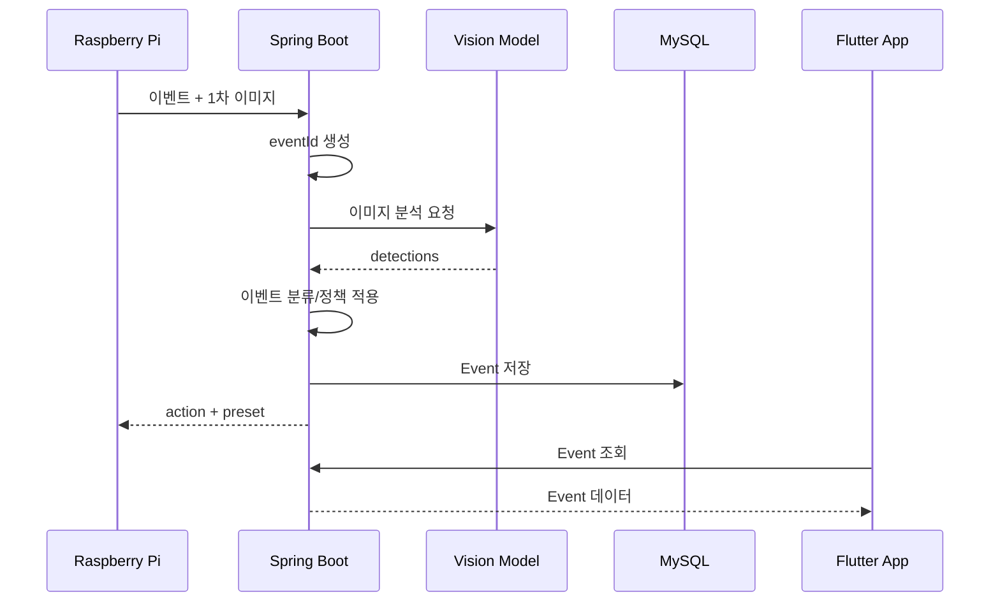
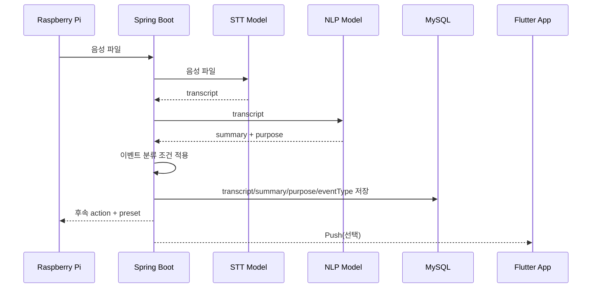

# DataCat 무인현관 API 명세서

> **Version**: v1.0  
> **Date**: 2026-09-20  
> **Scope**: Raspberry Pi ↔ Spring Boot ↔ 모델 서비스 ↔ Flutter App  
> **Status**: 팀 합의용 초안. `TBD` 항목은 이벤트 분류 기획 또는 구현 과정에서 확정한다.

---

## 1. 문서 목적

이 문서는 DataCat 무인현관 프로젝트에서 각 담당 파트가 **어떤 데이터를 어떤 형식으로 주고받는지** 정의한다.

핵심 구조는 다음과 같다.

```text
Raspberry Pi
    ↓
Spring Boot
    ├─→ 이미지 인식 모델
    ├─→ STT 모델
    ├─→ 자연어 처리 모델
    ├─→ MySQL
    └─→ Flutter App / Push
```

Spring Boot는 단순 저장 서버가 아니라 **전체 흐름을 중개하고 상태를 관리하는 중앙 서버**다.

모델끼리는 직접 통신하지 않는다.

```text
Pi → Spring → STT → Spring → NLP → Spring
Pi → Spring → Vision → Spring
```

모델 구현체는 개발 중 변경될 수 있으므로 API 이름에는 `YOLO`, `Whisper`, `Qwen` 같은 특정 모델명을 넣지 않고 **기능 기준**으로 정의한다.

---

## 2. 담당 범위

| 담당 | 주요 역할 |
|---|---|
| Raspberry Pi | ToF/버튼 이벤트 감지, 사진 촬영, 음성 녹음, Spring으로 전송, Spring 응답에 따라 프리셋/LED/스피커 등 실행 |
| Spring Boot | API 제공, `eventId` 생성, 이벤트 상태 관리, 모델 API 순차 호출, 이벤트 분류 조건문 구현, DB 저장, 프리셋 결정, 앱 API, Push, 예외 처리 |
| 모델 담당 | 이미지 인식, STT, 자연어 처리(요약/용건 분석). 서버가 전달한 입력을 모델에 넣고 정해진 형식의 결과를 Spring에 반환 |
| 앱 + 이벤트 분류 담당 | Flutter 앱 구현, 상황 분류 종류와 조건 기획, 초인종 3D 모델링 |

> **중요:** 이벤트 분류 담당은 **분류 종류와 조건을 기획**하고, 실제 조건문/판정 코드는 Spring Boot에 구현한다.

---

## 3. 실행 및 배포 구조

테스트와 최종 시연은 **한 PC에서 실행**하는 것을 기본으로 한다.

```text
[한 PC]
 ├─ Spring Boot
 ├─ Model Service
 │   ├─ Vision
 │   ├─ STT
 │   └─ NLP
 └─ MySQL
```

Spring Boot는 Docker 컨테이너로 배포한다. 팀원은 GitHub 저장소를 내려받아 자신의 PC에서 서버를 실행해 각 파트와 연동 테스트한다.

모델 담당은 GPU를 사용할 수 있으나 특정 GPU 모델(RTX 3090 등)에 API 명세가 종속되지 않는다.

---

## 4. 공통 규칙

### 4.1 Base URL

외부 API(Pi/App → Spring):

```text
http://{host}:{port}/api/v1
```

Spring → 모델 서비스 내부 API:

```text
http://model-service:{port}/internal/v1
```

> 실제 호스트명/포트는 Docker Compose 및 실행 환경에서 확정한다.

### 4.2 Content-Type

JSON 요청/응답:

```http
Content-Type: application/json
```

이미지/음성 파일 업로드:

```http
Content-Type: multipart/form-data
```

### 4.3 시간 형식

ISO-8601 사용.

```text
2026-09-20T22:30:00+09:00
```

### 4.4 ID

- `eventId`: Spring Boot가 발급하는 방문 이벤트 식별자
- `deviceId`: Raspberry Pi 장치 식별자

예시:

```text
eventId: 101
deviceId: door-01
```

---

## 5. 공통 상태값

### 5.1 TriggerType

| 값 | 의미 |
|---|---|
| `TOF` | ToF 센서 감지로 시작 |
| `BUTTON` | 호출벨 입력으로 시작 |

### 5.2 EventStatus

| 값 | 의미 |
|---|---|
| `CREATED` | Event 생성 |
| `VISION_ANALYZING` | 이미지 분석 중 |
| `WAITING_AUDIO` | 방문객 음성 입력 대기 |
| `SPEECH_ANALYZING` | STT/NLP 처리 중 |
| `CLASSIFYING` | 서버 이벤트 분류 중 |
| `COMPLETED` | 정상 종료 |
| `FAILED` | 처리 실패 |

### 5.3 DeviceAction

| 값 | Pi 동작 |
|---|---|
| `START_RECEPTION` | 프리셋 안내 후 음성 입력 시작 |
| `SILENT_STANDBY` | 출력 없이 세션 처리/종료 |
| `PLAY_PRESET` | 지정된 프리셋 재생 |
| `END_SESSION` | 세션 종료 후 초기 감시 상태 복귀 |
| `ERROR` | 로컬 오류 안내 후 종료 |

---

# 6. Raspberry Pi → Spring API

## 6.1 이벤트 생성 + 1차 이미지 전송

방문 이벤트 발생 직후 Pi가 1차 이미지를 Spring으로 전송한다.

### Endpoint

```http
POST /api/v1/device/events
```

### Request

`multipart/form-data`

| 필드 | 타입 | 필수 | 설명 |
|---|---|---:|---|
| `metadata` | JSON | O | 이벤트 메타데이터 |
| `image` | File | O | 1차 판정용 이미지 |

`metadata` 예시:

```json
{
  "deviceId": "door-01",
  "triggerType": "TOF",
  "capturedAt": "2026-09-20T22:30:00+09:00"
}
```

### Spring 처리 순서

```text
1. 요청 검증
2. Event 생성 및 eventId 발급
3. 1차 이미지 저장
4. Vision API 호출
5. Vision 결과 수신
6. 현재 이벤트 분류/정책 적용
7. Pi가 수행할 action 반환
```

### Response 예시 — 사람 응대 필요

```json
{
  "eventId": 101,
  "status": "WAITING_AUDIO",
  "action": "START_RECEPTION",
  "preset": {
    "presetId": 1,
    "text": "마이크에 말씀해 주세요."
  }
}
```

### Response 예시 — 무응답 처리

```json
{
  "eventId": 102,
  "status": "COMPLETED",
  "action": "SILENT_STANDBY"
}
```

> 어떤 Vision 결과에서 `START_RECEPTION` 또는 `SILENT_STANDBY`로 분기할지는 이벤트 분류 기획에 따라 Spring 조건문으로 구현한다.

---

## 6.2 2차 기록용 스냅샷 전송

사람 응대 분기에서 프리셋 출력 후 촬영한 기록용 스냅샷을 전송한다.

### Endpoint

```http
POST /api/v1/device/events/{eventId}/snapshot
```

### Request

`multipart/form-data`

| 필드 | 타입 | 필수 |
|---|---|---:|
| `image` | File | O |

### Response

```json
{
  "eventId": 101,
  "saved": true,
  "snapshotUrl": "/api/v1/events/101/snapshot"
}
```

> 물건만 감지되어 2차 촬영을 하지 않는 경우에는 1차 촬영 이미지를 기록용 스냅샷으로 사용할 수 있다.

---

## 6.3 방문객 음성 전송

Pi가 방문객 발화를 녹음한 뒤 음성 파일을 Spring으로 전송한다.

### Endpoint

```http
POST /api/v1/device/events/{eventId}/audio
```

### Request

`multipart/form-data`

| 필드 | 타입 | 필수 | 설명 |
|---|---|---:|---|
| `audio` | File | O | 방문객 음성 파일 |

### Spring 처리 순서

```text
1. Pi → Spring : 음성 파일
2. Spring → STT : 음성 파일
3. STT → Spring : 전사 텍스트
4. Spring → NLP : 전사 텍스트
5. NLP → Spring : 요약 + 용건 분석 결과
6. Spring : 이벤트 분류 조건 적용
7. Spring : Event/DB 갱신
8. Spring : Pi에 후속 action 반환
9. Spring : 필요 시 앱 Push
```

### Response 예시

```json
{
  "eventId": 101,
  "status": "COMPLETED",
  "action": "PLAY_PRESET",
  "preset": {
    "presetId": 2,
    "text": "접수되었습니다."
  }
}
```

> STT 원문, 요약, 용건 분석 결과는 서버/앱용 데이터다. Pi가 반드시 받을 필요는 없다.

---

## 6.4 세션 종료 알림

ToF로 방문객 이탈을 감지했거나 Pi가 세션 종료 사실을 서버에 알려야 할 때 사용한다.

### Endpoint

```http
POST /api/v1/device/events/{eventId}/end
```

### Request

```json
{
  "reason": "VISITOR_LEFT",
  "endedAt": "2026-09-20T22:30:30+09:00"
}
```

`reason` 예시:

- `VISITOR_LEFT`
- `DEVICE_CANCELLED`
- `TIMEOUT`

### Response

```json
{
  "eventId": 101,
  "status": "COMPLETED",
  "action": "END_SESSION"
}
```

> 서버 타이머에 의해 세션이 종료되는 경우에는 Pi가 이 API를 호출하지 않아도 된다.

---

# 7. Spring → 모델 서비스 내부 API

모델 서비스는 Spring Boot에서만 호출한다.

모델끼리는 직접 호출하지 않는다.

```text
Spring → Vision → Spring
Spring → STT → Spring → NLP → Spring
```

---

## 7.1 이미지 인식

### Endpoint

```http
POST /internal/v1/vision/detect
```

### Request

`multipart/form-data`

| 필드 | 타입 | 필수 |
|---|---|---:|
| `image` | File | O |

### Response

```json
{
  "detections": [
    {
      "label": "person",
      "confidence": 0.94
    }
  ]
}
```

### 필드 설명

| 필드 | 타입 | 설명 |
|---|---|---|
| `detections` | Array | 이미지에서 인식된 항목 목록 |
| `label` | String | 모델이 반환한 클래스 이름 |
| `confidence` | Number | 모델 신뢰도, 0.0 ~ 1.0 |

> `YOLO`는 현재 후보 모델이지만 구현체가 바뀌어도 이 API 계약은 유지한다.

> bounding box가 서버 판정에 필요해질 경우 `bbox` 필드를 선택적으로 추가할 수 있다. 현재 MVP에서는 필수 아님.

---

## 7.2 STT 전사

### Endpoint

```http
POST /internal/v1/speech/transcribe
```

### Request

`multipart/form-data`

| 필드 | 타입 | 필수 |
|---|---|---:|
| `audio` | File | O |

### Response

```json
{
  "transcript": "택배 왔습니다. 문 앞에 놓고 갈게요."
}
```

### 필드 설명

| 필드 | 타입 | 필수 | 설명 |
|---|---|---:|---|
| `transcript` | String | 음성을 텍스트로 변환한 전사 결과 |

> Whisper 등 어떤 STT 모델을 쓰더라도 Spring은 동일한 응답 형식을 받는다.

---

## 7.3 자연어 처리 — 요약 / 용건 분석

Spring이 STT에서 받은 `transcript`를 다시 NLP API에 전달한다.

### Endpoint

```http
POST /internal/v1/language/analyze
```

### Request

```json
{
  "transcript": "택배 왔습니다. 문 앞에 놓고 갈게요."
}
```

### Response

```json
{
  "summary": "택배 배송 방문",
  "purpose": "DELIVERY"
}
```

### 필드 설명

| 필드 | 타입 | 필수 | 설명 |
|---|---|---:|---|
| `summary` | String | 방문객 발화 요약 |
| `purpose` | String | 자연어 모델이 판단한 용건 분류 결과 |

> `Qwen` 계열 sLM은 현재 후보 모델이며 다른 모델로 변경될 수 있다. Spring은 모델 이름이 아니라 위 API 계약에만 의존한다.

> `purpose`의 실제 분류 종류와 허용 값은 이벤트 분류 기획과 모델 담당 협의를 통해 확정한다. `DELIVERY`는 예시 값이다.

---

# 8. 용건 분석과 최종 이벤트 분류의 차이

두 값은 구분한다.

### purpose

자연어 모델이 **방문객이 무슨 용건으로 왔는지** 분석한 결과.

예시:

```text
DELIVERY
MAINTENANCE
VISIT
```

### eventType

Spring이 **Vision 결과 + ToF/버튼 상태 + purpose + 이벤트 분류 담당이 기획한 조건**을 종합해 최종 결정한 상황 분류.

```text
Vision 결과
+ 센서/트리거 정보
+ purpose
+ 이벤트 분류 조건
        ↓
Spring 조건문
        ↓
eventType
```

`eventType`의 종류와 조건은 현재 기획 중이므로 API 문서에서는 `TBD`로 둔다.

---

# 9. Flutter App → Spring API

## 9.1 이벤트 목록 조회

### Endpoint

```http
GET /api/v1/events?page=0&size=20
```

### Response

```json
{
  "content": [
    {
      "eventId": 101,
      "deviceId": "door-01",
      "eventType": null,
      "purpose": "DELIVERY",
      "summary": "택배 배송 방문",
      "status": "COMPLETED",
      "occurredAt": "2026-09-20T22:30:00+09:00",
      "snapshotUrl": "/api/v1/events/101/snapshot"
    }
  ],
  "page": 0,
  "size": 20,
  "totalElements": 1
}
```

> `eventType`은 이벤트 분류 기획 확정 전까지 `null` 또는 미확정 값이 될 수 있다.

---

## 9.2 이벤트 상세 조회

### Endpoint

```http
GET /api/v1/events/{eventId}
```

### Response

```json
{
  "eventId": 101,
  "deviceId": "door-01",
  "triggerType": "TOF",
  "eventType": null,
  "purpose": "DELIVERY",
  "transcript": "택배 왔습니다. 문 앞에 놓고 갈게요.",
  "summary": "택배 배송 방문",
  "status": "COMPLETED",
  "snapshotUrl": "/api/v1/events/101/snapshot",
  "occurredAt": "2026-09-20T22:30:00+09:00",
  "endedAt": "2026-09-20T22:30:30+09:00"
}
```

---

## 9.3 이벤트 스냅샷 조회

### Endpoint

```http
GET /api/v1/events/{eventId}/snapshot
```

### Response

```http
Content-Type: image/jpeg
```

---

# 10. 프리셋 API

실시간 대화 대신 **프리셋 기반 응대**를 사용한다.

## 10.1 프리셋 목록 조회

```http
GET /api/v1/presets
```

### Response

```json
[
  {
    "presetId": 1,
    "type": "GREETING",
    "text": "마이크에 말씀해 주세요."
  },
  {
    "presetId": 2,
    "type": "COMPLETION",
    "text": "접수되었습니다."
  }
]
```

---

## 10.2 프리셋 수정

```http
PUT /api/v1/presets/{presetId}
```

### Request

```json
{
  "text": "마이크에 용건을 말씀해 주세요."
}
```

### Response

```json
{
  "presetId": 1,
  "type": "GREETING",
  "text": "마이크에 용건을 말씀해 주세요."
}
```

---

# 11. Push 알림

방문 이벤트 알림이 필요할 경우 Push 서비스를 사용한다.

## 11.1 Push Token 등록

```http
POST /api/v1/push-tokens
```

### Request

```json
{
  "deviceToken": "FCM_DEVICE_TOKEN",
  "platform": "ANDROID"
}
```

### Push Payload 예시

```json
{
  "type": "VISIT_EVENT",
  "eventId": "101",
  "title": "새 방문이 있습니다.",
  "body": "방문 용건이 접수되었습니다."
}
```

앱은 Push에서 `eventId`를 받은 뒤 상세 API를 호출한다.

```http
GET /api/v1/events/101
```

---

# 12. 오류 응답 규칙

모든 JSON 오류 응답은 아래 형식을 사용한다.

```json
{
  "code": "MODEL_SERVER_TIMEOUT",
  "message": "모델 서버 응답 시간이 초과되었습니다."
}
```

| HTTP Status | 의미 |
|---:|---|
| `200` | 정상 처리 |
| `201` | 리소스 생성 성공 |
| `400` | 잘못된 요청 |
| `401` | 인증 실패 |
| `404` | Event/Device 등 리소스 없음 |
| `409` | 현재 Event 상태에서 수행할 수 없는 요청 |
| `500` | Spring 내부 오류 |
| `503` | 모델 서비스 또는 외부 의존 서비스 사용 불가 |

Pi는 네트워크 실패 또는 서버 타임아웃 시 로컬 fallback 안내를 재생하고 세션을 종료한다.

---

# 13. 전체 시퀀스

## 13.1 이미지 처리



## 13.2 음성 처리



---

# 14. 이벤트 데이터 모델 초안

Spring 내부 Event 엔티티 초안.

```text
Event
- id
- deviceId
- triggerType
- status
- eventType        // 최종 이벤트 분류, TBD
- purpose          // NLP 용건 분석 결과
- transcript       // STT 원문
- summary          // NLP 요약
- snapshotPath
- createdAt
- updatedAt
- endedAt
```

> DB 컬럼명과 JPA 타입은 실제 구현 시 변경할 수 있다. API 계약과 DB 스키마는 동일한 개념을 사용하되 1:1로 같을 필요는 없다.

---

# 15. 구현 우선순위

## Phase 1 — 이미지 흐름 먼저 연결

```text
Pi
→ Spring
→ Vision
→ Spring
→ MySQL
→ App
```

우선 구현 API:

```http
POST /api/v1/device/events
POST /internal/v1/vision/detect
GET  /api/v1/events
GET  /api/v1/events/{eventId}
```

## Phase 2 — 음성 흐름 추가

```text
Pi
→ Spring
→ STT
→ Spring
→ NLP
→ Spring
→ MySQL / App
```

추가 구현 API:

```http
POST /api/v1/device/events/{eventId}/snapshot
POST /api/v1/device/events/{eventId}/audio
POST /internal/v1/speech/transcribe
POST /internal/v1/language/analyze
POST /api/v1/device/events/{eventId}/end
```

## Phase 3 — 서비스 기능 보강

- 프리셋 관리
- Push
- 기기 인증
- 사용자 인증
- 공통 예외 처리
- Docker 배포 안정화

---

# 16. 현재 미확정(TBD) 항목

아래 항목은 임의로 확정하지 않고 팀 논의 후 업데이트한다.

1. `purpose`의 실제 분류 종류와 허용 값
2. 최종 `eventType` 종류와 분류 조건
3. 각 상황에 연결할 프리셋 종류/문구
4. 모델 서비스 실제 포트 및 Docker 서비스 이름
5. 기기 인증 방식 및 키 발급 방법
6. Push 서비스의 최종 선택/세부 payload
7. 서버 타임아웃 수치
8. Vision 응답에 bounding box가 필요한지 여부

---

# 17. API 변경 원칙

모델 자체는 변경될 수 있지만 Spring과 모델 서비스 사이의 API 계약은 최대한 유지한다.

예:

```text
STT 모델 A → STT 모델 B
```

로 변경되더라도:

```http
POST /internal/v1/speech/transcribe
```

및

```json
{
  "transcript": "..."
}
```

형식은 유지한다.

API 형식 자체를 변경해야 하는 경우에는 이 문서를 먼저 수정하고 팀원에게 공유한다.

---

# 18. GitHub 권장 위치

```text
repository/
├─ README.md
├─ docs/
│  └─ API.md
├─ src/
├─ Dockerfile
└─ docker-compose.yml
```

권장 Commit Message:

```text
docs: add initial API specification
```

---

## 변경 이력

| Version | Date | 내용 |
|---|---|---|
| `v1.0` | 2026-09-20 | 최초 API 명세서 |
