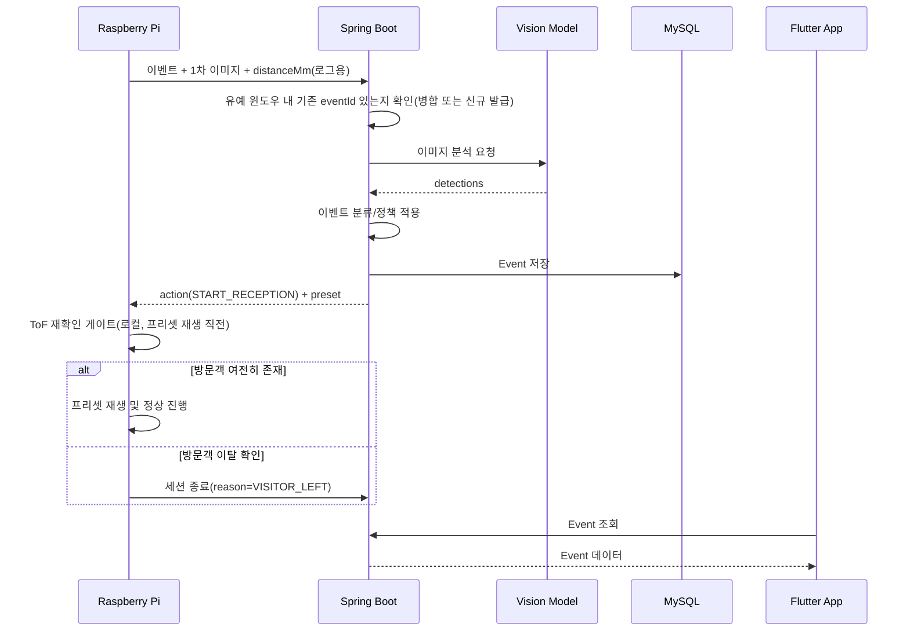
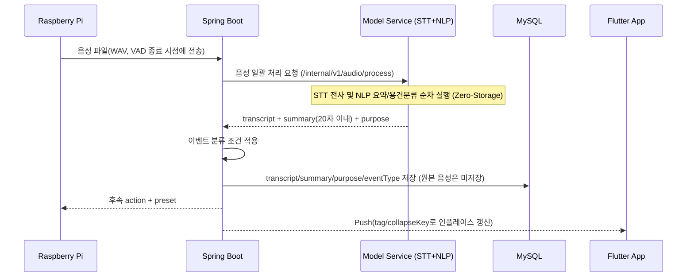

# DataCat 무인현관 API 명세서

> **Version**: v1.3  
> **Date**: 2026-09-27  
> **Scope**: Raspberry Pi ↔ Spring Boot ↔ 모델 서비스 ↔ Flutter App  
> **Status**: 팀 합의용 확정본. `TBD` 항목은 이벤트 분류 기획 또는 실측 과정에서 확정한다.  
> **v1.3 변경**: ToF 재확인 게이트를 Spring(서버, 지연된 값 재사용)에서 Pi(현관기기, 실시간 로컬 판단)로 이동. 6.4 세션 종료 API의 트리거 조건을 이 로직에 맞춰 구체화. `EventStatus`를 실제 관측되는 상태만 남기도록 축소. 12장 오류 코드에서 미구현 인증(401) 제거. 4.1 모델 서비스 주소를 예시 표기임을 명확히 함. 13.1/13.2 시퀀스 다이어그램을 Pi-로컬 ToF 재확인 반영해 수정.

---

## 1. 문서 목적

이 문서는 DataCat 무인현관 프로젝트에서 각 담당 파트가 **어떤 데이터를 어떤 형식으로 주고받는지** 정의한다.

핵심 구조는 다음과 같다.

```text
Raspberry Pi
    ↓
Spring Boot
    ├─→ 이미지 인식 모델
    ├─→ STT 모델
    ├─→ 자연어 처리 모델
    ├─→ MySQL
    └─→ Flutter App / Push
```

Spring Boot는 단순 저장 서버가 아니라 **전체 흐름을 중개하고 상태를 관리하는 중앙 서버**다.

모델끼리는 직접 통신하지 않는다.

```text
Pi → Spring → STT → Spring → NLP → Spring  (또는 Spring → 통합 Audio Process → Spring)
Pi → Spring → Vision → Spring
```

모델 구현체는 개발 중 변경될 수 있으므로 API 이름에는 `YOLO`, `Whisper`, `Qwen` 같은 특정 모델명을 넣지 않고 **기능 기준**으로 정의한다.

---

## 2. 담당 범위

| 담당 | 주요 역할 |
|---|---|
| Raspberry Pi | ToF/버튼 이벤트 감지, 사진 촬영, 음성 녹음, Spring으로 전송, Spring 응답에 따라 프리셋/LED/스피커 등 실행 |
| Spring Boot | API 제공, `eventId` 생성, 이벤트 상태 관리, 모델 API 순차 호출, 이벤트 분류 조건문 구현, DB 저장, 프리셋 결정, 앱 API, Push, 예외 처리 |
| 모델 담당 | 이미지 인식, STT, 자연어 처리(요약/용건 분석). 서버가 전달한 입력을 모델에 넣고 정해진 형식의 결과를 Spring에 반환 |
| 앱 + 이벤트 분류 담당 | Flutter 앱 구현, 상황 분류 종류와 조건 기획, 초인종 3D 모델링 |

> **중요:** 이벤트 분류 담당은 **분류 종류와 조건을 기획**하고, 실제 조건문/판정 코드는 Spring Boot에 구현한다.

---

## 3. 실행 및 배포 구조

테스트와 최종 시연은 **한 PC에서 실행**하는 것을 기본으로 한다.

```text
[한 PC]
 ├─ Spring Boot
 ├─ Model Service
 │   ├─ Vision
 │   ├─ STT
 │   └─ NLP
 └─ MySQL
```

Spring Boot는 Docker 컨테이너로 배포한다. 팀원은 GitHub 저장소를 내려받아 자신의 PC에서 서버를 실행해 각 파트와 연동 테스트한다.

모델 담당은 GPU를 사용할 수 있으나 특정 GPU 모델(RTX 3090 등)에 API 명세가 종속되지 않는다.

> **분산 개발 환경 지원**: 평소 개발 중에는 팀원 각자 자신의 PC에서 전체 스택(Spring + Model + MySQL)을 띄워 테스트한다. 단일 물리 Pi가 그때그때 다른 팀원의 서버를 바라볼 수 있도록, Pi 단말은 `.env` 파일 기본값 또는 실행 시 CLI 인자(`--server-url=...`)로 접속 대상 서버 URL을 교체할 수 있게 구현한다. 통합 테스트·리허설 시에만 한 곳(Pi 거치 관리자의 서버)으로 고정한다.

---

## 4. 공통 규칙

### 4.1 Base URL

외부 API(Pi/App → Spring):

```text
https://api.{도메인}/api/v1
```

> Cloudflare Tunnel을 통한 공인 HTTPS 접근을 기본으로 한다. 로컬 개발 시에는 팀원 PC의 사설 주소(`http://{host}:{port}/api/v1`)를 `.env`로 대체할 수 있다.

Spring → 모델 서비스 내부 API:

```text
http://{model-service-host}:{port}/internal/v1
```

> 예시 표기이며, 실제 호스트명/포트/Docker 서비스 이름은 Docker Compose 및 실행 환경에서 확정한다(16장 TBD 참고).

### 4.2 Content-Type

JSON 요청/응답:

```http
Content-Type: application/json
```

이미지/음성 파일 업로드:

```http
Content-Type: multipart/form-data
```

### 4.3 시간 형식

ISO-8601 사용.

```text
2026-09-20T22:30:00+09:00
```

### 4.4 ID

- `eventId`: Spring Boot가 발급하는 방문 이벤트 식별자
- `deviceId`: Raspberry Pi 장치 식별자

예시:

```text
eventId: 101
deviceId: door-01
```

---

## 5. 공통 상태값

### 5.1 TriggerType

| 값 | 의미 |
|---|---|
| `TOF` | ToF 센서 감지로 시작 |
| `BUTTON` | 호출벨 입력으로 시작 |

### 5.2 EventStatus

| 값 | 의미 |
|---|---|
| `WAITING_AUDIO` | 방문객 음성 입력 대기 |
| `COMPLETED` | 정상 종료 |
| `FAILED` | 처리 실패 |

> 전체 파이프라인은 Pi의 요청-응답 한 번 안에서 동기적으로 처리되며 별도의 폴링(polling) 수단이 없다. `CREATED`, `VISION_ANALYZING`, `SPEECH_ANALYZING`, `CLASSIFYING` 같은 중간 상태는 어떤 API 응답에서도 관측될 수 없으므로 v1.3에서 제거했다. 위 3개 값만 실제로 응답에 등장한다.

### 5.3 DeviceAction

| 값 | Pi 동작 |
|---|---|
| `START_RECEPTION` | 프리셋 안내 후 음성 입력 시작 |
| `SILENT_STANDBY` | 출력 없이 세션 처리/종료 |
| `PLAY_PRESET` | 지정된 프리셋 재생 |
| `END_SESSION` | 세션 종료 후 초기 감시 상태 복귀 |
| `ERROR` | 로컬 오류 안내 후 종료 |

> **마이크 개방 시퀀스 제약**: `START_RECEPTION`을 받은 Pi는 반드시 프리셋 음성 출력이 끝난 뒤에만 마이크를 연다. 예고 없이 마이크를 여는 것은 금지한다 — 도청 관련 법적 리스크를 막기 위한 필수 제약이다.

> **ToF 재확인 게이트(Pi 로컬 처리)**: `START_RECEPTION`을 받은 Pi는 프리셋 음성을 재생하기 **직전** 자신의 ToF 센서를 다시 한번(로컬, 즉시) 읽어 사람이 여전히 있는지 확인한다. 1차 촬영과 서버 왕복 사이의 지연 동안 방문객(주로 배달 기사)이 이미 이탈했을 수 있기 때문이다. 이 재확인은 서버로 데이터를 보내 판정받지 않고 Pi가 전적으로 로컬에서 즉시 판단한다 — ToF는 Pi에 붙은 센서라 네트워크 왕복 없이 확인 가능하고, 지연 없는 최신값을 쓸 수 있기 때문이다.
> - ToF가 여전히 근접 범위를 감지하면 그대로 프리셋을 재생하고 정상 진행한다.
> - ToF가 기준선(빈 상태)으로 복귀했으면 프리셋을 재생하지 않고, `POST /api/v1/device/events/{eventId}/end`를 `reason: VISITOR_LEFT`로 호출해 세션을 무응답으로 종료한다(6.4 참고).

---

# 6. Raspberry Pi → Spring API

## 6.1 이벤트 생성 + 1차 이미지 전송

방문 이벤트 발생 직후 Pi가 1차 이미지를 Spring으로 전송한다.

### Endpoint

```http
POST /api/v1/device/events
```

### Request

`multipart/form-data`

| 필드 | 타입 | 필수 | 설명 |
|---|---|---:|---|
| `metadata` | JSON | O | 이벤트 메타데이터 |
| `image` | File (`image/jpeg`) | O | 1차 판정용 이미지 |

`metadata` 예시:

```json
{
  "deviceId": "door-01",
  "triggerType": "TOF",
  "distanceMm": 1850,
  "capturedAt": "2026-09-20T22:30:00+09:00"
}
```

> `distanceMm`: 촬영 시점 ToF 거리값(mm). 이벤트 기록·로그용 정보이며, 방문객 이탈 재확인은 Pi가 로컬에서 별도로 수행한다(5.3 참고). Spring의 판정에는 사용하지 않는다.

### Spring 처리 순서

```text
1. 요청 검증
2. 최근 세션이 유예 윈도우(30초) 내에 존재하는지 확인
   → 존재하면 새 eventId를 발급하지 않고 기존 eventId를 재사용·병합
   → 없으면 Event 생성 및 신규 eventId 발급
3. 1차 이미지 저장
4. Vision API 호출
5. Vision 결과 수신 (사람/물체 감지 여부)
6. 현재 이벤트 분류/정책 적용
7. Pi가 수행할 action 반환
```

> 사람 감지 시 `START_RECEPTION`을 반환하지만, 이 시점 이후 방문객이 실제로 자리에 있는지에 대한 최종 확인은 Pi가 로컬 ToF로 수행한다(5.3 참고). Spring은 지연된 값으로 재판정하지 않는다.

### Response 예시 — 사람 응대 필요

```json
{
  "eventId": 101,
  "status": "WAITING_AUDIO",
  "action": "START_RECEPTION",
  "preset": {
    "presetId": 1,
    "text": "마이크에 말씀해 주세요."
  }
}
```

### Response 예시 — 무응답 처리

```json
{
  "eventId": 102,
  "status": "COMPLETED",
  "action": "SILENT_STANDBY"
}
```

> 어떤 Vision 결과에서 `START_RECEPTION` 또는 `SILENT_STANDBY`로 분기할지는 이벤트 분류 기획에 따라 Spring 조건문으로 구현한다.

---

## 6.2 2차 기록용 스냅샷 전송

사람 응대 분기에서 프리셋 출력 후 촬영한 기록용 스냅샷을 전송한다.

### Endpoint

```http
POST /api/v1/device/events/{eventId}/snapshot
```

### Request

`multipart/form-data`

| 필드 | 타입 | 필수 |
|---|---|---:|
| `image` | File (`image/jpeg`) | O |

### Response

```json
{
  "eventId": 101,
  "saved": true,
  "snapshotUrl": "/api/v1/events/101/snapshot"
}
```

> 물건만 감지되어 2차 촬영을 하지 않는 경우에는 1차 촬영 이미지를 기록용 스냅샷으로 사용할 수 있다.

---

## 6.3 방문객 음성 전송

Pi가 방문객 발화를 녹음한 뒤 음성 파일을 Spring으로 전송한다.

> **녹음 종료 기준(VAD)**: Pi는 고정된 녹음 제한 시간을 두지 않고, VAD(음성 활동 감지)가 발화 후 700~1,000ms의 침묵을 감지하면 자동으로 녹음을 종료하고 즉시 전송한다.

### Endpoint

```http
POST /api/v1/device/events/{eventId}/audio
```

### Request

`multipart/form-data`

| 필드 | 타입 | 필수 | 설명 |
|---|---|---:|---|
| `audio` | File (`audio/wav`, PCM 16-bit, 16kHz, Mono) | O | 방문객 음성 파일. WAV/PCM 16kHz Mono는 Whisper 권장 입력 규격 |

> **Zero-Storage 원칙**: 음성 파일은 STT 전사가 완료되는 즉시 메모리 버퍼와 임시 파일에서 영구 삭제한다. 영구 DB에는 전사문·요약문 등 텍스트만 보관하고 원본 음성은 보관하지 않는다.

### Spring 처리 순서

```text
1. Pi → Spring : 음성 파일
2. Spring → STT/NLP 모델 서비스 : 음성 파일 전송 (7.4 통합 엔드포인트 권장)
3. 모델 서비스 : STT 전사 및 요약/용건 분석 일괄 수행
4. Spring : transcript, summary, purpose 수신
5. Spring : 이벤트 분류 조건 적용
6. Spring : Event/DB 갱신 (원본 음성은 비저장)
7. Spring : Pi에 후속 action 반환
8. Spring : 필요 시 앱 Push 발송 (인플레이스 태그 적용)
```

### Response 예시

```json
{
  "eventId": 101,
  "status": "COMPLETED",
  "action": "PLAY_PRESET",
  "preset": {
    "presetId": 2,
    "text": "접수되었습니다."
  }
}
```

> STT 원문, 요약, 용건 분석 결과는 서버/앱용 데이터다. Pi가 반드시 받을 필요는 없다.

---

## 6.4 세션 종료 알림

ToF로 방문객 이탈을 감지했거나 Pi가 세션 종료 사실을 서버에 알려야 할 때 사용한다.

> Pi는 5.3의 ToF 재확인 게이트에서 방문객이 이미 이탈한 것으로 판단되면(프리셋 재생 직전), 프리셋을 재생하지 않고 이 API를 `reason: VISITOR_LEFT`로 즉시 호출해 세션을 무응답으로 종료한다. 이것이 `VISITOR_LEFT`의 표준 트리거 조건이다.

### Endpoint

```http
POST /api/v1/device/events/{eventId}/end
```

### Request

```json
{
  "reason": "VISITOR_LEFT",
  "endedAt": "2026-09-20T22:30:30+09:00"
}
```

`reason` 값:

| 값 | 트리거 조건 |
|---|---|
| `VISITOR_LEFT` | Pi의 ToF 재확인 게이트(5.3)가 프리셋 재생 직전 방문객 이탈을 감지했을 때 |
| `TIMEOUT` | 마이크 개방 후 방문객 발화 없이 VAD 대기 시간이 초과되었을 때 |
| `DEVICE_CANCELLED` | *(예약, 현재 미사용)* — Pi 단말이 로컬 사유(전원 차단, 하드웨어 오류 등)로 세션을 강제 종료해야 할 경우를 위해 남겨둔 값. 현재 펌웨어 로직에는 이를 발생시키는 조건이 없으며, Phase 3 이후 트리거 조건이 정의되면 사용한다. |

### Response

```json
{
  "eventId": 101,
  "status": "COMPLETED",
  "action": "END_SESSION"
}
```

> 서버 타이머에 의해 세션이 종료되는 경우에는 Pi가 이 API를 호출하지 않아도 된다.

---

# 7. Spring → 모델 서비스 내부 API

모델 서비스는 Spring Boot에서만 호출한다.

모델끼리는 직접 호출하지 않는다.

```text
Spring → Vision → Spring
Spring → Audio Process (STT + NLP 통합) → Spring
```

---

## 7.1 이미지 인식

### Endpoint

```http
POST /internal/v1/vision/detect
```

### Request

`multipart/form-data`

| 필드 | 타입 | 필수 |
|---|---|---:|
| `image` | File (`image/jpeg`) | O |

### Response

```json
{
  "detections": [
    {
      "label": "person",
      "confidence": 0.94
    }
  ]
}
```

### 필드 설명

| 필드 | 타입 | 설명 |
|---|---|---|
| `detections` | Array | 이미지에서 인식된 항목 목록 |
| `label` | String | 모델이 반환한 클래스 이름. 허용 값: `person`, `box`(또는 `package`) |
| `confidence` | Number | 모델 신뢰도, 0.0 ~ 1.0 |

> `YOLO`는 현재 후보 모델이지만 구현체가 바뀌어도 이 API 계약은 유지한다.

> bounding box가 서버 판정에 필요해질 경우 `bbox` 필드를 선택적으로 추가할 수 있다. 현재 MVP에서는 필수 아님.

> **1차 판별 가이드(잠정)**: `detections` 배열 내 `label == 'person'` 존재 여부를 기본 신호로 Spring이 `START_RECEPTION`/`SILENT_STANDBY`를 판정한다. 이 판정 이후 실제 응대 시점(프리셋 재생 직전)에 방문객이 여전히 있는지에 대한 재확인은 Spring이 아니라 Pi가 로컬 ToF로 수행한다(5.3 참고) — Vision 응답은 지연된 이미지 한 장에 대한 판단일 뿐이므로 이탈 여부의 최종 근거로 쓰지 않는다. 세부 조건문은 이벤트 분류 기획 확정 후 Spring에 구현한다.

---

## 7.2 STT 전사 (단위 테스트용)

### Endpoint

```http
POST /internal/v1/speech/transcribe
```

### Request

`multipart/form-data`

| 필드 | 타입 | 필수 |
|---|---|---:|
| `audio` | File (`audio/wav`, PCM 16-bit, 16kHz, Mono) | O |

### Response

```json
{
  "transcript": "택배 왔습니다. 문 앞에 놓고 갈게요."
}
```

### 필드 설명

| 필드 | 타입 | 필수 | 설명 |
|---|---|---:|---|
| `transcript` | String | 음성을 텍스트로 변환한 전사 결과 |

> Whisper 등 어떤 STT 모델을 쓰더라도 Spring은 동일한 응답 형식을 받는다.

> **Zero-Storage 원칙**: 모델 서비스도 전사 완료 즉시 수신한 음성 파일을 삭제하며, 별도로 보관하지 않는다.

---

## 7.3 자연어 처리 — 요약 / 용건 분석 (단위 테스트용)

Spring이 STT에서 받은 `transcript`를 다시 NLP API에 전달한다.

### Endpoint

```http
POST /internal/v1/language/analyze
```

### Request

```json
{
  "transcript": "택배 왔습니다. 문 앞에 놓고 갈게요."
}
```

### Response

```json
{
  "summary": "택배 배송 방문",
  "purpose": "DELIVERY"
}
```

### 필드 설명

| 필드 | 타입 | 필수 | 설명 |
|---|---|---:|---|
| `summary` | String | 방문객 발화 요약. **공백 포함 최대 20자 이내.** Spring Boot 수신 시 20자 초과분은 `substring(0, 19) + "…"`로 방어적 절단(truncate)한다 |
| `purpose` | String | 자연어 모델이 판단한 용건 분류 결과 |

> `Qwen` 계열 sLM은 현재 후보 모델이며 다른 모델로 변경될 수 있다. Spring은 모델 이름이 아니라 위 API 계약에만 의존한다.

> `purpose`의 실제 분류 종류와 허용 값은 이벤트 분류 기획과 모델 담당 협의를 통해 최종 확정한다. 현재 초기 후보 값(이벤트 분류 담당 최종 승인 필요): `DELIVERY`(배송), `INSPECTION`(시설점검), `VISIT`(지인방문), `ETC`(기타).

---

## 7.4 음성 일괄 처리 (권장 — STT+용건분류 통합 엔드포인트)

Spring ↔ Python이 매 단계마다 왕복하지 않도록, 같은 서버 내부에서 STT와 용건분류를 순차 처리해 최종 결과만 한 번에 반환하는 엔드포인트를 둔다. 7.2/7.3의 개별 엔드포인트는 단위 테스트용으로 유지하되, 실제 런타임에서는 이 통합 엔드포인트 사용을 권장한다.

### Endpoint

```http
POST /internal/v1/audio/process
```

### Request

`multipart/form-data`

| 필드 | 타입 | 필수 |
|---|---|---:|
| `audio` | File (`audio/wav`, PCM 16-bit, 16kHz, Mono) | O |

### Response

```json
{
  "transcript": "택배 문 앞에 두고 갑니다.",
  "purpose": "DELIVERY",
  "summary": "택배 문 앞 보관 완료"
}
```

> 내부적으로 STT → 용건분류를 순차 처리하며, 중간 결과를 Spring으로 돌려보내지 않는다. `transcript`/`purpose`/`summary` 각 필드의 제약은 7.2, 7.3과 동일하다. Zero-Storage 원칙도 동일하게 적용한다.

---

# 8. 용건 분석과 최종 이벤트 분류의 차이

두 값은 구분한다.

### purpose

자연어 모델이 **방문객이 무슨 용건으로 왔는지** 분석한 결과.

예시:

```text
DELIVERY
INSPECTION
VISIT
```

### eventType

Spring이 **Vision 결과 + ToF/버튼 상태 + purpose + 이벤트 분류 담당이 기획한 조건**을 종합해 최종 결정한 상황 분류.

```text
Vision 결과
+ 센서/트리거 정보
+ purpose
+ 이벤트 분류 조건
        ↓
Spring 조건문
        ↓
eventType
```

`eventType`의 최종 종류와 조건은 이벤트 분류 담당의 기획 확정 후 반영한다. 현재 초기 후보 값(승인 필요):

| 값 | 의미 |
|---|---|
| `UNATTENDED_DELIVERY` | 사람 없음/이탈 + 물건 있음 (무응답 배송 완료) |
| `VISITOR_ACCEPTED` | 사람 감지 + 용건 접수 완료 |
| `VISITOR_TIMEOUT` | 호출 후 응답 없이 이탈 (부재 처리) |

---

# 9. Flutter App → Spring API

## 9.1 이벤트 목록 조회

### Endpoint

```http
GET /api/v1/events?page=0&size=20
```

### Response

```json
{
  "content": [
    {
      "eventId": 101,
      "deviceId": "door-01",
      "eventType": null,
      "purpose": "DELIVERY",
      "summary": "택배 배송 방문",
      "status": "COMPLETED",
      "occurredAt": "2026-09-20T22:30:00+09:00",
      "snapshotUrl": "/api/v1/events/101/snapshot"
    }
  ],
  "page": 0,
  "size": 20,
  "totalElements": 1
}
```

> `eventType`은 이벤트 분류 기획 확정 전까지 `null` 또는 미확정 값이 될 수 있다.

---

## 9.2 이벤트 상세 조회

### Endpoint

```http
GET /api/v1/events/{eventId}
```

### Response

```json
{
  "eventId": 101,
  "deviceId": "door-01",
  "triggerType": "TOF",
  "eventType": null,
  "purpose": "DELIVERY",
  "transcript": "택배 왔습니다. 문 앞에 놓고 갈게요.",
  "summary": "택배 배송 방문",
  "status": "COMPLETED",
  "snapshotUrl": "/api/v1/events/101/snapshot",
  "occurredAt": "2026-09-20T22:30:00+09:00",
  "endedAt": "2026-09-20T22:30:30+09:00"
}
```

---

## 9.3 이벤트 스냅샷 조회

### Endpoint

```http
GET /api/v1/events/{eventId}/snapshot
```

### Response

```http
Content-Type: image/jpeg
```

---

# 10. 프리셋 API

실시간 대화 대신 **프리셋 기반 응대**를 사용한다.

## 10.1 프리셋 목록 조회

```http
GET /api/v1/presets
```

### Response

```json
[
  {
    "presetId": 1,
    "type": "GREETING",
    "text": "마이크에 말씀해 주세요."
  },
  {
    "presetId": 2,
    "type": "COMPLETION",
    "text": "접수되었습니다."
  }
]
```

---

## 10.2 프리셋 수정 — Phase 3으로 이동 (Phase 1/2 범위 아님)

> **보류 사유**: 현관기기에는 런타임 TTS 엔진이 없다. `presetId`는 고정 음원 파일에 매핑되어 있어, 앱에서 `text`를 수정해도 Pi가 실제로 재생하는 음성은 바뀌지 않는다 — "문구는 바뀌는데 소리는 안 바뀌는" API가 되어 혼란을 준다. Phase 1/2에서는 프리셋을 하드웨어·Spring Boot에 고정 음원/문구로 상주시키고, 동적 수정 API는 TTS 엔진 도입이 검토되는 Phase 3(상용화 확장 과제)로 이동한다.

```http
PUT /api/v1/presets/{presetId}
```

*(Phase 3 검토 시 아래 계약을 유지)*

### Request

```json
{
  "text": "마이크에 용건을 말씀해 주세요."
}
```

### Response

```json
{
  "presetId": 1,
  "type": "GREETING",
  "text": "마이크에 용건을 말씀해 주세요."
}
```

---

# 11. Push 알림

방문 이벤트 알림이 필요할 경우 Push 서비스를 사용한다.

## 11.1 Push Token 등록

```http
POST /api/v1/push-tokens
```

### Request

```json
{
  "deviceToken": "FCM_DEVICE_TOKEN",
  "platform": "ANDROID"
}
```

### Push Payload 예시

```json
{
  "tag": "event_101",
  "collapseKey": "event_101",
  "type": "VISIT_EVENT",
  "eventId": "101",
  "title": "새 방문이 있습니다.",
  "body": "방문 용건이 접수되었습니다."
}
```

> **인플레이스(In-Place) 갱신**: `tag`/`collapseKey`를 `"event_{eventId}"` 고정 규격으로 넣는다. 세션 유예 윈도우(30초) 내에 벨 재입력이나 추가 발화가 발생해 같은 eventId로 병합되면, 새 알림을 쌓지 않고 기존 알림창의 내용을 덮어쓴다.

앱은 Push에서 `eventId`를 받은 뒤 상세 API를 호출한다.

```http
GET /api/v1/events/101
```

---

# 12. 오류 응답 규칙

모든 JSON 오류 응답은 아래 형식을 사용한다.

```json
{
  "code": "MODEL_SERVER_TIMEOUT",
  "message": "모델 서버 응답 시간이 초과되었습니다."
}
```

| HTTP Status | 의미 |
|---:|---|
| `200` | 정상 처리 |
| `201` | 리소스 생성 성공 |
| `400` | 잘못된 요청 |
| `401` | 인증 실패 — *Phase 3 예약, 현재 미구현(인증 체계 자체가 없음)* |
| `404` | Event/Device 등 리소스 없음 |
| `409` | 현재 Event 상태에서 수행할 수 없는 요청 |
| `500` | Spring 내부 오류 |
| `503` | 모델 서비스 또는 외부 의존 서비스 사용 불가 |

**서버 응답 대기 타임아웃**: 초기 권장 **3~5초**. 10초 이상은 방문객이 기기를 고장으로 오인해 이탈할 수 있으므로 상한으로 두지 않는다. 2.4GHz Wi-Fi·Cloudflare Tunnel 왕복 지연 실측 후 조정하되, 오탐(false timeout)이 잦으면 상향 조정한다.

Pi는 네트워크 실패 또는 서버 타임아웃 시 아래 3대 수칙에 따라 로컬 Fallback을 수행한다.

1. **마이크 즉시 차단** — 이 시점까지 마이크가 열려 있었다면 즉시 닫는다.
2. **임시 버퍼 즉시 파기** — 메모리·디스크의 이미지/오디오 임시 파일을 즉시 삭제한다. 별도의 오프라인 재전송 큐는 두지 않는다(Zero-Storage 원칙과 동일한 맥락).
3. **고정 안내 1회 출력 후 복귀** — 사전 저장된 오류 문구("일시적인 오류로 접수할 수 없습니다. 잠시 후 다시 시도해 주세요")를 1회 출력한 뒤 세션을 종료하고 초기 감시 상태로 복귀한다.

---

# 13. 전체 시퀀스

## 13.1 이미지 처리



## 13.2 음성 처리



---

# 14. 이벤트 데이터 모델 초안

Spring 내부 Event 엔티티 초안.

```text
Event
- id
- deviceId
- triggerType
- distanceMm       // 촬영 시점 ToF 거리값(mm), 로그·기록용 (이탈 판정은 Pi 로컬에서 수행, 5.3 참고)
- status
- eventType        // 최종 이벤트 분류, TBD
- purpose          // NLP 용건 분석 결과
- transcript       // STT 원문
- summary          // NLP 요약
- snapshotPath
- createdAt
- updatedAt
- endedAt
```

> DB 컬럼명과 JPA 타입은 실제 구현 시 변경할 수 있다. API 계약과 DB 스키마는 동일한 개념을 사용하되 1:1로 같을 필요는 없다.

---

# 15. 구현 우선순위

## Phase 1 — 이미지 흐름 먼저 연결

```text
Pi
→ Spring
→ Vision
→ Spring
→ MySQL
→ App
```

우선 구현 API:

```http
POST /api/v1/device/events
POST /internal/v1/vision/detect
GET  /api/v1/events
GET  /api/v1/events/{eventId}
```

## Phase 2 — 음성 흐름 추가

```text
Pi
→ Spring
→ Model Service (STT + NLP 통합)
→ Spring
→ MySQL / App
```

추가 구현 API:

```http
POST /api/v1/device/events/{eventId}/snapshot
POST /api/v1/device/events/{eventId}/audio
POST /internal/v1/audio/process   (권장 — 7.4, STT+용건분류 통합)
POST /internal/v1/speech/transcribe  (단위 테스트용)
POST /internal/v1/language/analyze   (단위 테스트용)
POST /api/v1/device/events/{eventId}/end
```

## Phase 3 — 서비스 기능 보강

- 프리셋 관리
- Push
- 기기 인증
- 사용자 인증
- 공통 예외 처리
- Docker 배포 안정화

---

# 16. 현재 미확정(TBD) 항목

아래 항목은 임의로 확정하지 않고 팀 논의 후 업데이트한다.

1. `purpose`의 최종 허용 값 — 초기 후보(7.3 참고)는 제시됨, 이벤트 분류 담당 최종 승인 필요
2. 최종 `eventType` 종류와 분류 조건 — 초기 후보(8장 참고)는 제시됨, 이벤트 분류 담당 최종 승인 필요
3. 각 상황에 연결할 프리셋 종류/문구
4. 모델 서비스 실제 포트 및 Docker 서비스 이름
5. 기기 인증 방식 및 키 발급 방법
6. Push 서비스의 최종 선택/세부 payload
7. Vision 응답에 bounding box가 필요한지 여부
8. 세션 유예 윈도우(30초)·ToF 복귀 안정화 시간(3~5초)의 정확한 값 — 시제품 실측 후 확정

---

# 17. API 변경 원칙

모델 자체는 변경될 수 있지만 Spring과 모델 서비스 사이의 API 계약은 최대한 유지한다.

예:

```text
STT 모델 A → STT 모델 B
```

로 변경되더라도:

```http
POST /internal/v1/speech/transcribe
```

및

```json
{
  "transcript": "..."
}
```

형식은 유지한다.

API 형식 자체를 변경해야 하는 경우에는 이 문서를 먼저 수정하고 팀원에게 공유한다.

---

# 18. GitHub 권장 위치

```text
repository/
├─ README.md
├─ docs/
│  └─ API.md
├─ src/
├─ Dockerfile
└─ docker-compose.yml
```

권장 Commit Message:

```text
docs: add initial API specification
```

---

## 변경 이력

| Version | Date | 내용 |
|---|---|---|
| `v1.0` | 2026-09-20 | 최초 API 명세서 |
| `v1.1` | 2026-09-21 | 세션 유예 윈도우 병합, ToF 재확인 게이트, 마이크 개방 시퀀스, VAD 종료 기준, 파일 포맷(JPEG/WAV) 명시, Zero-Storage 원칙, FCM 인플레이스 태그, 확정 수치(타임아웃 3~5초·요약 20자) 반영, STT+용건분류 통합 엔드포인트(7.4) 추가, 프리셋 수정 API Phase 3 이동, Base URL을 HTTPS로 변경 |
| `v1.2` | 2026-09-21 | 13.2 음성 처리 시퀀스 다이어그램 단일화(Model Service 일괄 처리 반영), 8장 용건 예시 용어 통일(`MAINTENANCE` → `INSPECTION`), 14장 Event 엔티티에 `distanceMm` 필드 추가, Phase 2 아키텍처 표기 보완 |
| `v1.3` | 2026-09-27 | **ToF 재확인 게이트를 Spring→Pi로 이동**(6.1 `distanceMm`은 로그용으로 격하, Spring 처리 순서에서 재확인 단계 제거, 5.3에 Pi 로컬 게이트 블록 추가), 6.4 `reason` 값에 트리거 조건 표로 명시(`VISITOR_LEFT`=Pi 게이트 발동, `DEVICE_CANCELLED`=예약/미사용), `EventStatus`를 실제 관측 가능한 3개 값(`WAITING_AUDIO`/`COMPLETED`/`FAILED`)으로 축소, 12장 `401` 오류 코드에 Phase 3 예약·미구현 주석 추가, 4.1 모델 서비스 Base URL을 예시 플레이스홀더로 변경, 7.1 판별 가이드에서 Spring의 `distanceMm` 재판정 언급 제거, 13.1 시퀀스 다이어그램을 Pi-로컬 ToF 게이트 반영해 수정 |