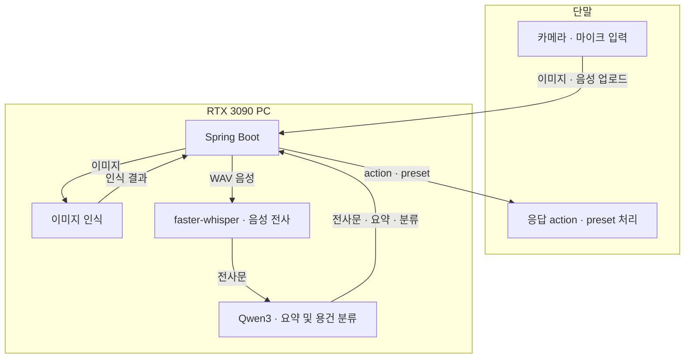

# Raspberry Pi 4 환경 설정 및 RTX 3090 연동

Raspberry Pi 4에서 영상과 음성을 수집하고, RTX 3090 서버에서 음성 전사·요약·용건 분류를 수행하는 단말 연동 구성이다.

## 1. 실행 환경

| 구성 요소 | 환경 및 역할 |
|---|---|
| Raspberry Pi 4 | Ubuntu 22.04 Desktop, USB 웹캠 영상 수집 |
| 음성 테스트 단말 | Ubuntu 노트북, 내장 마이크·스피커 |
| Spring Boot | 방문 이벤트 관리, 모델 서비스 호출 및 단말 응답 |
| RTX 3090 모델 서비스 | 이미지 인식, faster-whisper 음성 전사, Qwen3 요약·용건 분류 |

음성 입력 규격: **WAV / PCM 16-bit / 16kHz / mono**

## 2. RTX 3090 처리 파이프라인



1. 단말이 방문 이벤트를 생성하고 `eventId`를 받는다.
2. 녹음한 음성을 Spring Boot에 업로드한다.
3. Spring Boot가 모델 서비스의 `/internal/v1/audio/process`를 호출한다.
4. 모델 서비스가 음성을 전사하고 요약·용건 분류 결과를 반환한다.
5. 단말이 응답의 `action`과 `preset`에 따라 후속 동작을 수행한다.

## 3. 실행 명령어

### 오디오 장치 확인

Ubuntu 소리 설정에서 입력 장치와 출력 장치를 선택하고 음소거를 해제한다.

```bash
# 녹음 장치 확인
arecord -l

# 재생 장치 확인
aplay -l
```

### 음성 녹음 및 재생

```bash
# 16kHz, 16-bit, mono 형식으로 5초 녹음
arecord -D default -f S16_LE -r 16000 -c 1 -d 5 /tmp/voice-test.wav

# 녹음 파일 재생
aplay /tmp/voice-test.wav
```

### RTX 3090 상태 확인

RTX 3090 서버에서 실행한다.

```bash
nvidia-smi
```

### 모델 서비스 상태 확인

Spring Boot와 모델 서비스를 실행한 뒤, 아래 주소와 포트를 실제 환경에 맞게 변경한다.

```bash
export MODEL_BASE_URL='http://<RTX3090_IP>:<MODEL_PORT>'
export SPRING_BASE_URL='http://<RTX3090_IP>:<SPRING_PORT>'

curl --fail --show-error "$MODEL_BASE_URL/health"
```

### 음성 업로드

방문 이벤트 생성 API에서 받은 `eventId`를 입력한다.

```bash
export EVENT_ID='<eventId>'

curl --fail --show-error --request POST \
  "$SPRING_BASE_URL/api/v1/device/events/$EVENT_ID/audio" \
  --form 'audio=@/tmp/voice-test.wav;type=audio/wav'
```

인증이 필요한 환경에서는 API 명세에 맞는 인증 헤더를 추가한다. 응답의 `action`과 `preset`을 확인하고 단말에서 해당 동작을 수행한다.

### 테스트 파일 삭제

```bash
rm -f /tmp/voice-test.wav
```

## 4. 확인 현황

| 항목 | 상태 |
|---|---|
| Raspberry Pi 4 Ubuntu 22.04 Desktop 설치 | 완료 |
| USB 웹캠 연결 및 영상 출력 | 완료 |
| 노트북 내장 마이크·스피커 녹음 및 재생 | 완료 |
| RTX 3090 서버 연동 | 구성 정리, 실서버 검증 대기 |
| VAD 기반 발화 종료 | 구현 예정 |
| 서버 응답에 따른 단말 출력 | 구현 예정 |

음성 입출력은 노트북에서 확인했으며, Raspberry Pi의 마이크·스피커는 별도 검증이 필요하다.
