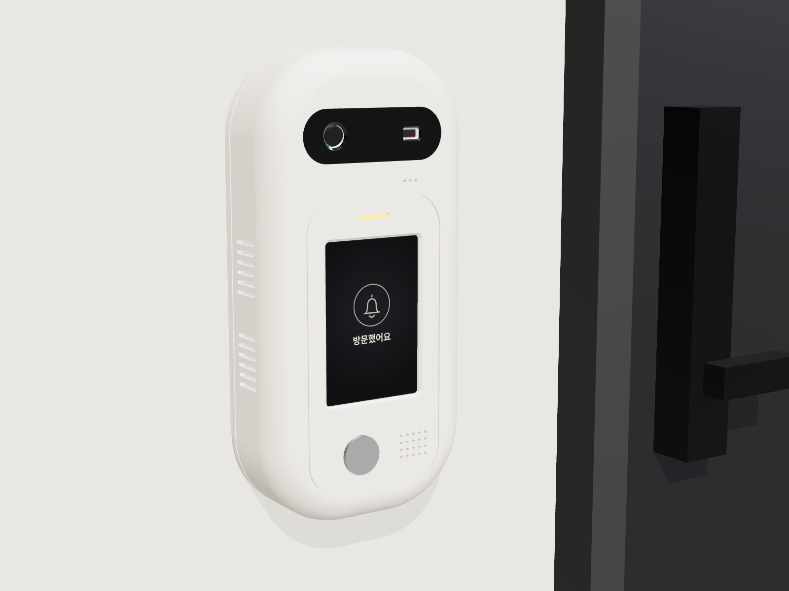
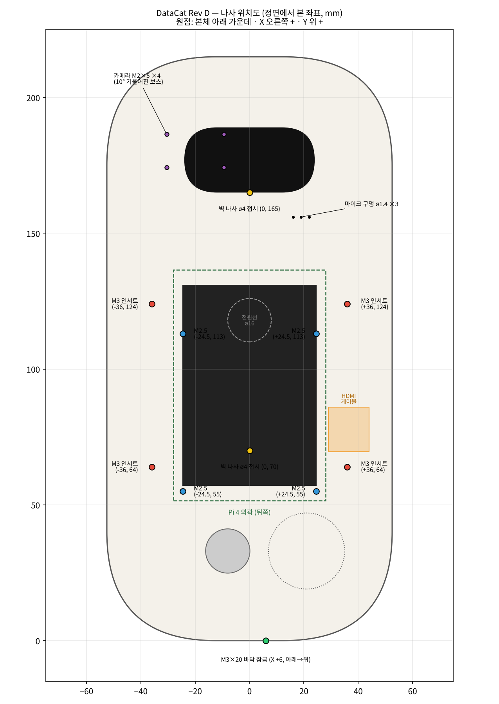
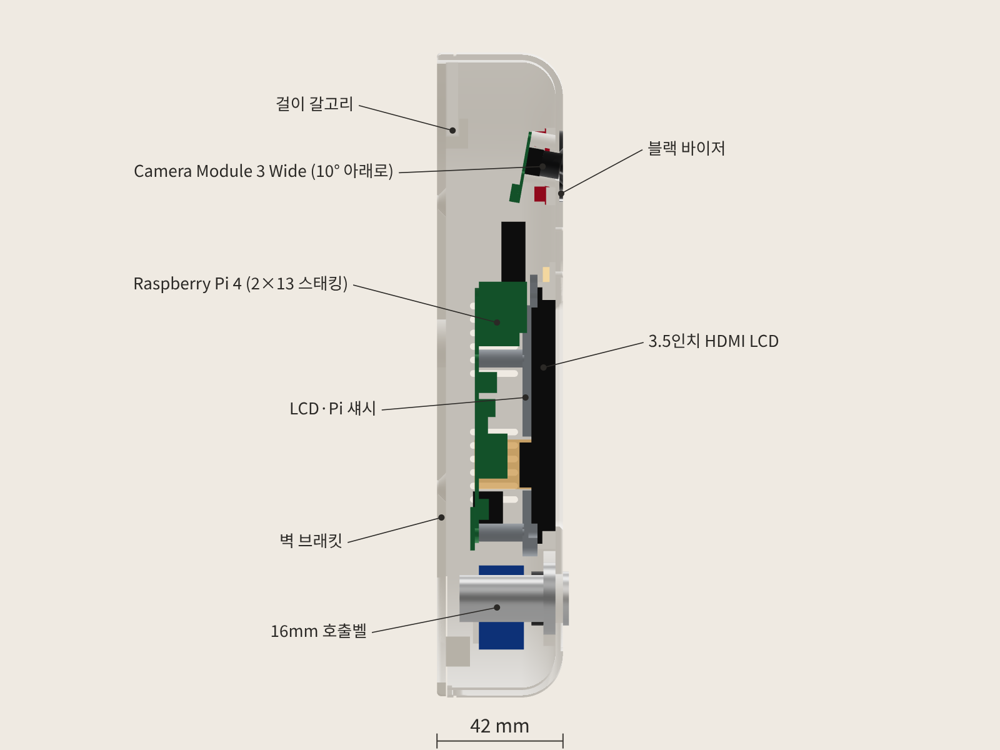
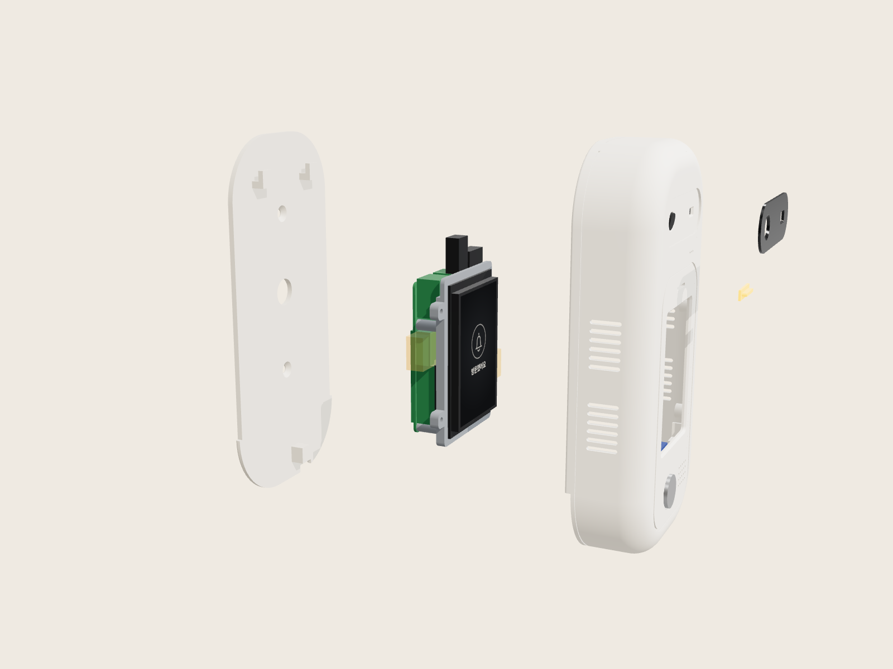

# DataCat 무인현관 초인종 외함 Rev D

새 부품표(USB 마이크·USB 스피커·3.5인치 HDMI LCD·ToF Qwiic Mini·16 mm 버튼)를 반영한 버전입니다. 외형(105 × 215 × 42 mm, 알약형 + 블랙 바이저)은 Rev C와 같고, 내부와 체결 위치를 새 부품에 맞춰 다시 짰습니다.



## 한눈에

| 항목 | 값 |
|---|---|
| 외형 | **105 × 215 × 42 mm** (가로 × 세로 × 벽에서 전면까지) |
| 출력 부품 | 5개: 전면 쉘, LCD·Pi 섀시, 벽 브래킷, 블랙 바이저, LED 라이트파이프 |
| 부품 간 간섭 | **0 mm³** (출력 부품 5개 + 실제 부품·배선 공간 13개 전부 검사) |
| 외피 밖으로 나온 부품 | 0 mm³ |
| 카메라 / ToF 화각 가림 | 0.002 mm³(메시 오차) / 0 mm³ |
| 벽 브래킷 걸기 경로 | 전 구간 충돌 0 |
| STL | 5개 모두 watertight, 각 부품 단일 솔리드 |
| 출력 크기 | 가장 큰 쉘이 105 × 215 × 42 → 220 × 220 베드(Ender-3급)에 들어감 |

자세한 수치는 `validation.json`에 있습니다.

## Rev C → Rev D 바뀐 점

| 부품 | Rev C | Rev D |
|---|---|---|
| 마이크 | INMP441 (I2S) + 바이저 구멍 | **USB 마이크 동글** → Pi **USB 2.0** 위쪽 포트. 쉘 앞 ø1.4 소리 구멍 3개 |
| 스피커 | MAX98357A 앰프 + ø28 스피커 | **USB 스피커**. 케이스를 열어 ø28 유닛은 그릴 뒤 링에, USB 보드는 오른쪽 아래 선반에 붙임. 플러그는 **USB 3.0** 위쪽 포트 |
| 화면 | SPI LCD | **Waveshare 3.5inch HDMI LCD** (GPIO로 5 V 전원). LCD HDMI 단자 자리만큼 섀시 오른쪽 레일을 비움 |
| 영상 연결 | 없음 (SPI) | micro-HDMI → HDMI. **U자 어댑터 대신 FPC 리본 케이블** (아래 설명) |
| GPIO 스태킹 헤더 | 2×20 | **2×13** (1~26번 핀만) |
| 앰프 리브, 마이크 링 | 있음 | 삭제 |
| 벽 브래킷 (Rev D.1) | 걸고 내리는 거리만큼 아래가 짧아 뒷면 아래에 7.8 mm 틈 | **아랫단 40 mm를 쉘 바깥 윤곽까지 넓혀 뒷면을 끝까지 막음.** 쉘 뒤 테두리 아래쪽을 3.4 mm 따내서 걸고 내리는 방식은 그대로 |

## ⚠ 부품표에서 바꿔야 할 것 4가지

1. **micro-HDMI→HDMI U자 어댑터는 이 구조에서 안 맞습니다.** U자 어댑터는 LCD를 Pi 핀에 바로 꽂았을 때의 간격에 맞춰져 있습니다. 그런데 Pi 4는 USB 포트 높이가 16 mm라서, 바로 꽂으면 LCD 뒷면이 USB 포트에 얹히고 27~40번 핀에 선을 꽂을 자리도 없습니다. 그래서 스태킹 헤더로 LCD를 19.5 mm 띄웠고, 그러면 U자 어댑터 간격이 맞지 않습니다.
   → **"micro HDMI 90° + HDMI 90° FPC 리본 케이블 10 cm"** 세트(드론·FPV용으로 흔함)로 바꾸세요. 모델에 이 케이블 공간(주황 박스, X 29~44 / Y 69.5~86)을 비워 두었습니다.
2. **GPIO 스태킹 헤더는 2×20이 아니라 2×13.** 2×20 롱핀을 쓰면 27~40번 핀이 LCD 기판 뒷면에 2.5 mm 박힙니다. LCD는 1~26번만 쓰므로 2×13 롱핀 스태킹 헤더를 쓰거나, 2×20을 26/27번 사이에서 니퍼로 잘라 쓰세요.
3. **ToF 전원(3.3 V)과 I2C(GPIO2·3)는 1·3·5번 핀이라 스태킹 헤더 밑에 가려집니다.** 3.3 V가 나오는 핀이 1·17번뿐이라서 생기는 문제입니다. 해결법:
   - **권장:** Pi **뒷면** GPIO 납땜 끝에 전선 4가닥을 납땜합니다(1번 3.3V, 3번 SDA, 5번 SCL, 9번 GND). Qwiic→암 점퍼의 암 쪽을 잘라 쓰면 됩니다. Pi 뒷면과 벽 브래킷 사이에 9.6 mm 공간이 있어 전선이 지나갑니다. 소프트웨어는 부품표대로 I2C1(GPIO2·3) 그대로 씁니다.
   - 버튼과 LED는 위쪽 27~40번 핀에 꽂아도 됩니다. 다만 LCD 뒷면까지 11 mm밖에 없어서 일반 일자 듀폰(하우징 14 mm)은 안 들어가고, **ㄱ자(90°) 암 듀폰**이나 납땜이 필요합니다. 모델에 이 배선 공간(주황 박스, 왼쪽)을 비워 두었습니다.
4. **카메라 나사 M2 × 5 셀프태핑 × 4가 부품표에 없습니다.** Camera Module 3를 그대로 쓴다면 추가하세요(부품표에 카메라가 빠져 있는데, 모델에는 Rev C 위치에 그대로 두었습니다).

### 핀 배치 제안

| 부품 | Pi 핀 (물리 번호) | 연결 방법 |
|---|---|---|
| LCD 전원 | 1~26 (2×13 스태킹) | 스태킹 헤더 |
| ToF VL53L5CX | 1 (3.3V), 3 (GPIO2 SDA), 5 (GPIO3 SCL), 9 (GND) | Pi 뒷면 납땜 |
| 호출벨 버튼 | 29 (GPIO5), 30 (GND) | ㄱ자 듀폰 또는 납땜, 내부 풀업 |
| 버튼 LED 링 | 31 (GPIO6), 34 (GND) | 버튼에 저항 내장 확인. 3.3 V에선 조금 어두울 수 있음 |
| 상태 LED 3 mm (선택) | 33 (GPIO13) → 330Ω → LED → 39 (GND) | 〃 |

## 나사·체결 위치



좌표 기준은 정면에서 봤을 때 본체 아래 가운데가 원점이고, X는 오른쪽, Y는 위쪽이 +입니다.

| 체결 | 수량 | 위치 (X, Y) | 들어가는 곳 |
|---|---|---|---|
| **M3 열압입 인서트** | 4 | (±36, 64), (±36, 124) | 쉘 안쪽 보스(ø4.0 구멍, 깊이 5.5). 인두로 눌러 넣기 |
| **M3 × 8** | 4 | 위와 같음 | 섀시 귀 → 인서트 (뒤에서 앞으로) |
| **M2.5 × 6 셀프태핑** | 4 | (±24.5, 55), (±24.5, 113) | Pi → 섀시 스탠드오프(ø2.2 구멍) |
| **M3 × 20** | 1 | X +6, 바닥 | 쉘 바닥 구멍 → 벽 브래킷 잠금 보스 (아래에서 위로) |
| **ø4 접시머리 + 앵커** | 2 | (0, 70), (0, 165) | 벽 브래킷 → 벽 |
| M2 × 5 셀프태핑 (추가) | 4 | (−30.5 / −9.5, 174.2 / 186.5) | 카메라 → 10° 기울어진 보스(ø1.8) |
| 양면 폼테이프 | — | ToF(바이저 오른쪽 리브 안), USB 스피커 보드(오른쪽 아래 선반) | |
| 핫멜트 | — | 스피커 유닛 링, 바이저, 라이트파이프, 전선 고정 | |

## 들어가는 부품 (모델에 쓴 치수)

| 부품 | 치수 | 위치 |
|---|---|---|
| Raspberry Pi 4 + 방열판 14×14×8 | 85 × 56, M2.5 58 × 49 | 화면 뒤 세로, USB/LAN 위쪽 |
| Waveshare 3.5inch HDMI LCD | 85.5 × 56, 유리 4.4, 활성 48.96 × 73.44, HDMI 단자 15 × 11.5 × 6 (오른쪽) | 화면 창 바로 뒤 |
| HDMI FPC 케이블 | 공간 15 × 16.5 × 22.5 | Pi 오른쪽 (micro-HDMI0) |
| USB 마이크 동글 | 18.3 × 7.7, 포트 밖 10.5 돌출 | USB 2.0 위 포트 |
| USB 스피커 | 유닛 ø28 × 8 + 보드 28 × 28 × 15 공간 | 그릴 뒤 + 오른쪽 아래 선반 |
| ToF Qwiic Mini | 12.7 × 25.4 | 바이저 오른쪽 |
| Camera Module 3 Wide | 25 × 24 × 12.4 | 바이저 왼쪽, 10° 아래로 |
| 16 mm 메탈 LED 버튼 | 구멍 ø16.3, 너트 24, 뒤 길이 32 | 화면 아래 왼쪽 |
| 상태 LED 3 mm | — | 화면 위 라이트파이프 뒤 |



## 출력

| 파일 | 재질 | 출력 방향 (`stl_print`는 이미 맞춰 둠) | 서포트 |
|---|---|---|---|
| `01_front_shell` | PETG/ASA 흰색 (PLA도 실내면 OK) | 전면이 베드 쪽 | 베드에서만 서포트 (가장자리 R14) |
| `02_lcd_pi_chassis` | PETG/PLA | LCD 닿는 면이 베드 | 없음 |
| `03_wall_plate` | PETG/PLA | 벽 쪽 면이 베드 | 없음 (104 × 212 mm, 220 베드에 들어감) |
| `04_black_visor` | 검정 PETG | 바깥면이 베드 | 없음 |
| `05_led_light_pipe` | 투명 PETG/레진 | 플랜지가 베드 | 없음 (생략 가능) |

권장: 노즐 0.4, 레이어 0.2, 벽 3줄, 인필 20%. 인서트 구멍은 프린터마다 ±0.1 차이가 나므로 쉘 출력 전에 섀시만 먼저 뽑아 맞춰 보세요.

## 조립 순서

1. 쉘을 앞면이 아래로 가게 놓고, 인두로 M3 인서트 4개를 보스에 넣습니다. 바이저와 라이트파이프를 붙입니다.
2. 버튼을 앞에서 끼우고 너트를 조입니다. 스피커 유닛을 그릴 뒤 링에, 스피커 USB 보드를 오른쪽 아래 선반에 테이프로 붙입니다. ToF는 리브 안에 테이프로 붙입니다.
3. 카메라를 기울어진 보스에 M2 × 5로 고정하고 CSI 케이블(300 mm)을 꽂아 둡니다.
4. Pi 뒷면에 ToF 선 4가닥을 납땜하고, Pi를 섀시 스탠드오프에 M2.5 × 6 4개로 고정합니다.
5. Pi GPIO 1~26에 2×13 스태킹 헤더를 꽂고, HDMI FPC 케이블의 micro-HDMI 쪽을 **HDMI0**(USB-C 바로 옆)에 꽂습니다.
6. LCD를 유리 면이 창 쪽으로 가게 쉘 리브 안에 넣고, 섀시+Pi를 덮으면서 스태킹 헤더를 LCD 헤더에 맞춰 누릅니다. 섀시를 M3 × 8 4개로 조입니다. FPC 케이블 HDMI 쪽을 LCD에 꽂습니다.
7. USB 마이크를 USB 2.0(검정) 위 포트에, 스피커 USB를 USB 3.0(파랑) 위 포트에 꽂습니다. 버튼·LED·ToF 선을 연결합니다.
8. 벽 브래킷을 벽에 ø4 나사 2개로 고정하고, 쉘을 7.4 mm 올린 상태에서 벽에 대고 내려 겁니다. 바닥에서 M3 × 20으로 잠급니다.



## 부품 도착하면 잴 것 (`model.py` 맨 위 값만 고치면 됨)

| 잴 것 | 바꿀 값 | 왜 |
|---|---|---|
| 스태킹 헤더로 꽂았을 때 Pi 윗면 ~ LCD 뒷면 거리 | `STACK` (지금 19.5) | 모든 깊이 값이 여기서 나옵니다 |
| LCD HDMI 단자 위치·크기 | `LCD["hdmi_*"]`, `HDMI_Y` | Waveshare 공개 도면이 없어 Pi HDMI0 바로 위로 가정 |
| LCD 유리·활성 영역 위치 | `LCD` | 화면 창과 맞추기 |
| USB 스피커 유닛 지름, 보드 크기 | `SPEAKER["dia"]`, `USPK_BOARD` | 제품마다 다름 |
| USB 마이크 동글 크기 | `UMIC` | 10 mm 이상 튀어나오면 확인 |

블렌더 파일은 `blender/` 폴더에 있습니다(.blend는 Blender 5.2, 예전 버전은 .glb를 Import).

고친 뒤 다시 만들기:

```bash
pip install cadquery
python export_final.py      # step/, stl_print/, validation.json 다시 생성 + 검증
pip install bpy && python export_blender.py   # blender/ 다시 생성
```

## 남은 것

- 실내 복도용입니다(통풍구·케이블 홈 때문에 방수 아님).
- USB 스피커를 분해하지 않고 통째로 넣으려면 제품 크기를 보고 다시 배치해야 합니다.
- 모델의 주황 박스(HDMI 케이블, GPIO 27~40 배선)는 출력물이 아니라 비워 둔 공간 표시입니다.
