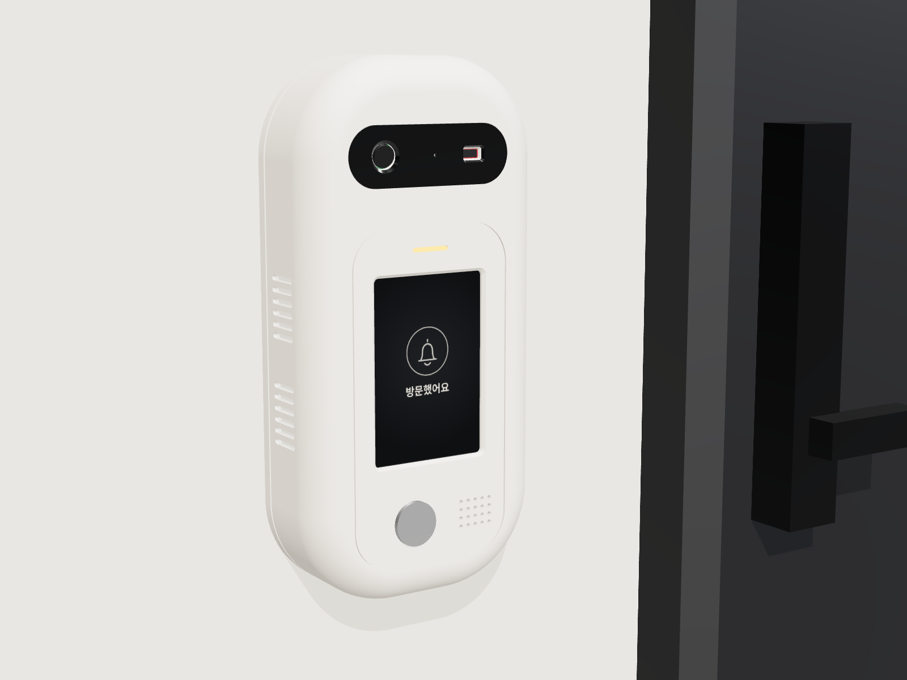
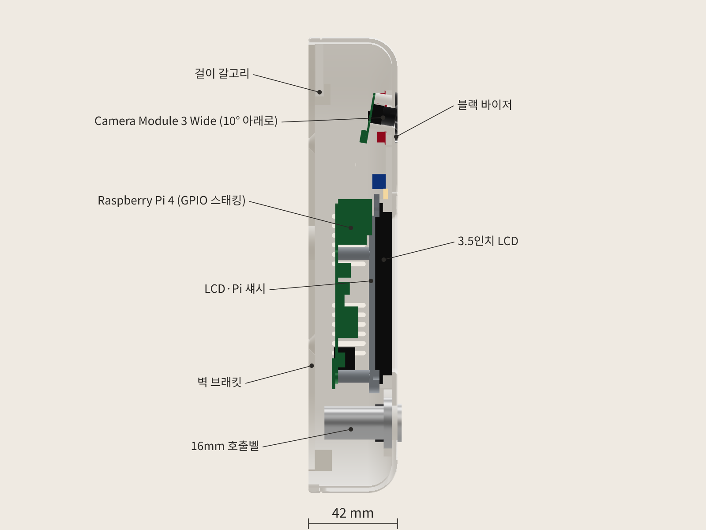
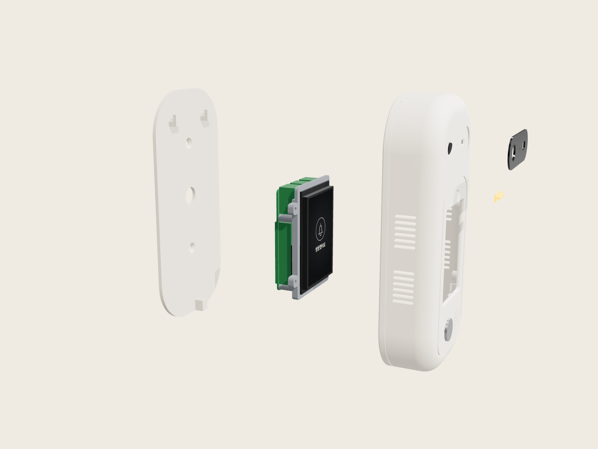

# DataCat 무인현관 초인종 외함 Rev C

레퍼런스 이미지(알약형 흰 본체, 위쪽 블랙 바이저, 아래쪽 화면·버튼·스피커 그릴)를 따르되, **기획서의 실제 부품을 실제 치수로 먼저 배치하고 그 둘레에 외형을 짠** 모델입니다.



## 한눈에

| 항목 | 값 |
|---|---|
| 외형 | **105 × 215 × 42 mm** (가로 × 세로 × 벽에서 전면까지) |
| 출력 부품 | 5개 — 전면 쉘, LCD·Pi 섀시, 벽 브래킷, 블랙 바이저, LED 라이트파이프 |
| 부품 간 간섭 | **0 mm³** (출력 부품 5 + 실제 부품 10, 105쌍 모두 검사) |
| 외피 밖으로 나온 부품 | 0 mm³ |
| 카메라 화각 가림 | 0.002 mm³ (메시 오차 수준, 사실상 0) — 수평 106° × 수직 72° 사각뿔로 검사 |
| ToF 화각 가림 | 0 mm³ — 45° × 45° |
| 벽 브래킷 걸기 경로 | 들어 올려 밀고(12→0 mm) 7.4 mm 내리는 전 구간 충돌 0 |
| STL | 5개 모두 watertight |

자세한 수치는 `validation.json`.

## 들어가는 부품 (실제 치수)

| 부품 | 모델에 쓴 치수 | 배치 |
|---|---|---|
| Raspberry Pi 4 Model B | PCB 85 × 56 × 1.4, M2.5 구멍 58 × 49, USB 16 / LAN 13.5 높이, USB·LAN 2.1 돌출 | 화면 뒤, 세로, USB/LAN 위쪽 |
| 3.5인치 SPI LCD (Waveshare 3.5" RPi LCD 계열) | PCB 85.5 × 56, 유리 4.4, 활성 영역 48.96 × 73.44, 2×13 헤더 | 화면 창 바로 뒤 |
| Camera Module 3 Wide | 25 × 24, 높이 12.4, ø2.2 구멍 21 × 12.5, 렌즈 중심 위 가장자리에서 9.6 | 바이저 왼쪽, **10° 아래로 기울임** |
| VL53L5CX (SparkFun Qwiic Mini ToF) | 12.7 × 25.4, 센서 6.4 × 3.0 | 바이저 오른쪽 |
| INMP441 마이크 | ø14 | 바이저 가운데 (ø1.2 구멍, 바이저에 가려 안 보임) |
| MAX98357A 앰프 (Adafruit) | 17.8 × 19.3 | 오른쪽 위 안쪽 |
| 스피커 | ø28 × 8 | 그릴 뒤 |
| 16 mm 메탈 버튼 + LED 링 | 구멍 ø16.3, 너트 24, 패널 뒤 32 | 화면 아래 왼쪽 |
| 상태 LED | 3 mm LED 또는 WS2812 1개 | 화면 위 라이트파이프 뒤 |

### 깊이 방향 적층 (벽 0 → 전면 42)

```
42.0  전면 바깥면
39.5  전면 안쪽면 = LCD 유리 앞면
33.5  LCD PCB 뒷면 ─┐
28.5~33.5 섀시        │ GPIO 스태킹 헤더로 직결 (19.5 mm)
14.0  Pi 부품면 ─────┘  USB(16 mm)가 LCD 아래로 들어감
12.6  Pi 납땜면
 3.0  벽 브래킷 앞면 (전원선 통로 7.6 mm)
 0.0  벽
```

**설계 포인트**: LCD를 2×20 GPIO 스태킹 헤더(높이 약 11 mm)로 Pi에 바로 꽂습니다. 이렇게 하면 LCD와 Pi 사이가 19.5 mm가 되어 USB/LAN 포트(16 mm)가 LCD 밑으로 들어가고, 리본 케이블이 필요 없습니다. 같은 이유로 전체 깊이를 Rev H의 50 mm에서 42 mm로 줄였습니다.



## 출력 부품

| 파일 | 재질 권장 | 출력 방향 (`stl_print`는 이미 맞춰 둠) | 비고 |
|---|---|---|---|
| `01_front_shell` | PETG 또는 ASA, 흰색 | 전면이 베드 쪽 | 가장자리 R14 곡면은 "베드에서만 서포트" |
| `02_lcd_pi_chassis` | PETG / PLA | LCD 닿는 면이 베드 쪽 (스탠드오프가 위로) | 서포트 불필요 |
| `03_wall_plate` | PETG / PLA | 벽 쪽 면이 베드 | 갈고리 6 mm 브리지 |
| `04_black_visor` | 검정 PETG (광택은 출력 후 투명 코팅) | 바깥면이 베드 | 1.2 mm 두께 |
| `05_led_light_pipe` | 투명 PETG / 레진 | 플랜지가 베드 | 없으면 생략 가능 |

## 체결 부품

- M3 열압입 인서트(ø4.0 구멍용) × 4 + M3 × 8 볼트 × 4 — 섀시를 쉘에 고정
- M2.5 × 6 셀프태핑 × 4 — Pi를 섀시 스탠드오프에 고정
- M2 × 5 셀프태핑 × 4 — 카메라
- M3 × 20 볼트 × 1 — 바닥에서 위로, 쉘을 벽 브래킷에 잠금
- ø4 접시머리 나사 + 앵커 × 2 — 벽 브래킷
- 2×20 GPIO 스태킹 헤더(롱핀, 11 mm) × 1
- 양면 폼테이프(ToF, 앰프), 순간접착제/핫멜트(스피커, 바이저, 라이트파이프), 마이크 개스킷 링(ø14, 0.8 mm)

## 조립 순서

1. 쉘을 앞면이 아래로 가게 놓고 바이저와 라이트파이프를 붙입니다.
2. 버튼을 앞에서 끼우고 안쪽에서 너트를 조입니다. 스피커, 마이크(개스킷), ToF(리브 안에 테이프), 앰프를 붙입니다.
3. 카메라를 기울어진 보스 4개에 M2 나사로 고정합니다. CSI 케이블(300 mm 권장)을 연결해 둡니다.
4. LCD를 유리 면이 창 쪽으로 가게 리브 안에 넣고, 섀시를 덮어 M3 4개로 조입니다.
5. Pi에 스태킹 헤더를 꽂고 LCD 헤더에 맞춰 누른 뒤 M2.5 4개로 섀시에 고정합니다. CSI·스피커·마이크·ToF·버튼·LED 배선을 연결합니다.
6. 벽 브래킷을 벽에 고정합니다. 전원선은 브래킷 가운데 ø16 구멍(벽 타공) 또는 쉘 바닥 오른쪽 홈(납작 케이블)으로 들어옵니다.
7. 쉘을 7.4 mm 올린 상태로 벽에 대고 내려 걸어, 위쪽 갈고리 두 개에 혀가 들어가게 합니다. 바닥에서 M3 × 20으로 잠급니다.



## 실측 후 바꿀 값 (`model.py` 맨 위)

부품을 실제로 산 뒤 아래 값만 고치고 `python export_final.py`를 다시 돌리면 모든 파일과 검증이 새로 만들어집니다.

- `LCD` — 사는 LCD 모델에 따라 유리 크기, 활성 영역 위치, 헤더 위치가 조금씩 다릅니다. 가장 먼저 확인하세요.
- `CAM["tilt"]` — 카메라 하향 각도. 기획서의 10~15° 후보 중 복도 실측으로 정합니다. 바꾸면 보스와 렌즈 구멍이 자동으로 따라갑니다.
- `TOF` — SparkFun Mini가 아닌 다른 VL53L5CX 보드를 쓰면 보드 크기를 바꿉니다.
- `SPEAKER["dia"]`, `BTN` — 실제 스피커 지름과 버튼 길이.
- `D` — 전체 깊이. 지금 Pi 뒤 전원선 통로가 7.6 mm입니다.

## 다시 만들기

```bash
pip install cadquery
python export_final.py      # step/, stl_print/, validation.json 생성
python checks.py            # 검증만
```

## 아직 남은 것

- 방수 구조 아님: 측면 통풍구와 바닥 케이블 홈이 있어 실내 복도용입니다.
- Pi 4 발열: SoC에 14 × 14 × 8 방열판 공간을 잡아 두었고 측면 통풍구 24개가 Pi 높이에 있습니다. 장시간 시연 전에 온도를 확인하세요.
- LCD 터치는 쓰지 않는 것으로 가정했습니다. 화면 앞은 쉘 두께 2.5 mm만큼 들어가 있습니다.
