# 무인현관 상황 분류 종류와 조건

이 문서는 **YOLO 사람·물품 감지 결과**, **ToF 체류 정보**, **STT 전사문**, **AI 요약**을 바탕으로 서버가 상황을 분류하기 위한 기준이다.

- 한 이벤트에는 **상위 분류 한 개**를 적용한다.
- 더 구체적인 용건이 확인되면 **세부 유형**을 함께 저장한다.
- 여러 조건이 충돌하거나 근거가 부족하면 **기타·판단 불가**로 처리한다.
- 분류 결과는 알림과 기록에만 사용하며 **자동 출입 허가에는 사용하지 않는다**.

## 한눈에 보는 전체 구조

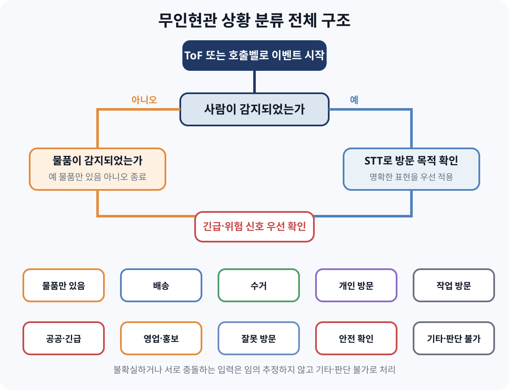

## 상황 분류 한눈에 보기

| 분류 | 핵심 조건 | 대표 상황 | 기본 처리 |
|---|---|---|---|
| 물품만 있음 | 사람 미감지 + 물품 감지 | 택배 상자, 음식 봉투, 선물, 정체불명 물품 | 무응답 알림 |
| 배송 | 사람 감지 + 배송 목적 발화 | 택배, 등기, 음식, 장보기, 퀵 | 일반 접수 |
| 수거 | 사람 감지 + 수거 목적 발화 또는 기존 물품 제거 | 반품, 교환, 용기, 폐가전 수거 | 일반 접수 |
| 개인 방문 | 사람 감지 + 만남 목적 발화 | 지인, 가족, 이웃, 약속 | 일반 접수 |
| 작업과 관리 방문 | 사람 감지 + 작업 목적 발화 | 점검, 수리, 설치, 청소, 이사 | 일반 접수 |
| 공공과 긴급 방문 | 공공기관 신원 또는 긴급 상황 명시 | 경찰, 소방, 구급, 화재, 대피 | 우선 알림 |
| 영업과 홍보 방문 | 판매·권유·홍보 목적 발화 | 광고, 종교, 설문, 모금, 선거 | 일반 접수 |
| 잘못 방문 | 주소·수령인·호수 착오가 명확함 | 잘못 누른 벨, 오배송, 이전 거주자 | 일반 기록 |
| 안전 확인 필요 | 위험 신호 또는 비정상 행동 | 위협, 반복 접근, 기기 접촉, 의심 물품 | 긴급 알림 |
| 기타와 판단 불가 | 목적을 확정할 근거가 없음 | 무응답, 소음, STT 실패, 입력 충돌 | 사용자 확인 |

---

## 1 물품만 있음

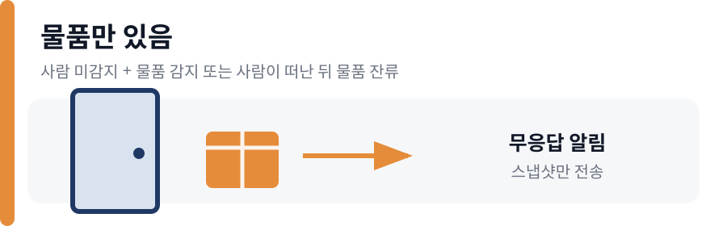

**판정 조건**

- YOLO에서 사람이 감지되지 않고 물품이 감지된다.
- 사람이 물품을 놓고 이탈한 뒤 물품만 남는다.
- 같은 물품이 계속 감지되면 새 이벤트를 만들지 않고 기존 이벤트의 잔류 상태만 갱신한다.

**포함 상황**

- 택배 상자, 봉투, 우편물, 쇼핑백이 놓임
- 음식 봉투, 음식 용기, 장보기 물품이 놓임
- 꽃, 선물, 케이크가 놓임
- 정체불명 물건, 쓰레기, 전단지가 놓임
- 기존 물품이 사라지거나 잠깐 보였다가 사라짐

**예외 조건**

- 이미지로 물품 종류를 확정할 수 없으면 **일반 물품 도착**으로 처리한다.
- 물품이 문을 막거나 위험해 보이면 **안전 확인 필요**를 우선 적용한다.
- 사람과 물품이 모두 없으면 센서 오탐 또는 이탈로 보고 이벤트를 종료한다.

---

## 2 배송

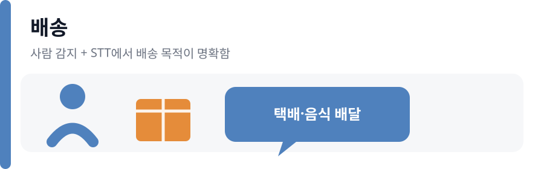

**판정 조건**

- 사람이 감지되고 STT에서 배송 목적이 명확하게 확인된다.
- 물품이 보인다는 이유만으로 배송으로 확정하지 않는다.

**세부 유형과 표현**

- **택배** 택배, 소포, 배송, 기사, 송장, 운송장, 문 앞에 두고 감
- **우편·등기** 우편, 우체국, 등기, 내용증명, 서명 필요
- **음식 배달** 음식, 치킨, 피자, 커피, 도시락, 주문 음식, 음식 배달 앱
- **장보기·생활물품** 마트, 생필품, 식료품, 새벽 배송
- **퀵 배송** 퀵, 당일 배송, 오토바이 배송
- **대형 상품** 가구, 가전, 대형 물품 배송
- **선물 배송** 꽃, 선물, 케이크 전달
- 물품 종류가 불명확하면 **배송 기타**로 처리한다.

**충돌 조건**

- 음식명이 명시되면 음식 배달을 택배보다 우선한다.
- 쿠팡 등 서비스명만 있고 음식 표현이 없으면 택배로 분류한다.
- 주소를 잘못 찾았다고 말하면 **잘못 방문**을 적용한다.

---

## 3 수거

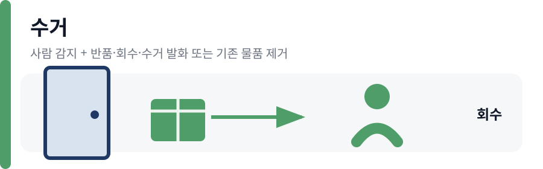

**판정 조건**

- 사람이 감지되고 반품·교환·회수·수거 목적을 말한다.
- 기존에 있던 물품을 가져가며 수거 목적이 확인된다.

**포함 상황**

- 반품·교환 상품 수거
- 세탁물, 렌탈 제품, 정수기 필터, 공병 수거
- 음식 용기, 보냉가방 수거
- 폐가전, 폐기물, 재활용품 수거
- 잘못 배송한 물품을 다시 가져감

**예외 조건**

- 발화 없이 기존 물품만 사라지면 **수거 여부 미확정**과 **사용자 확인 필요**를 기록한다.
- 놓인 물품과 다른 물품을 가져가도 절도로 단정하지 않고 **안전 확인 필요**로 처리한다.

---

## 4 개인 방문

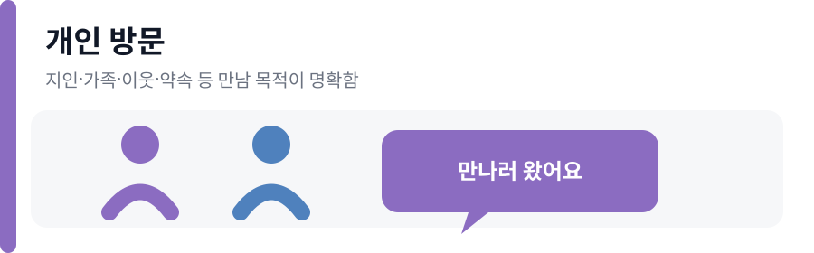

**판정 조건**

- 사람이 감지되고 특정 사람을 만나거나 사적인 약속이 있다는 목적을 말한다.

**포함 상황**

- 친구, 가족, 친척, 지인, 동료 방문
- 특정 입주자 이름을 말하며 만나러 옴
- 약속, 초대, 모임, 식사 방문
- 이웃, 위층·아래층 주민 방문
- 아이를 데리러 온 보호자 방문
- 이전 거주자, 집주인, 세입자를 찾는 방문

**예외 조건**

- 누구 있는지만 묻고 목적을 말하지 않으면 **목적 불명확 개인 방문**으로 처리한다.
- 입주자 본인이라고 주장해도 인증 수단이 없으면 입주자로 확정하지 않는다.

---

## 5 작업과 관리 방문

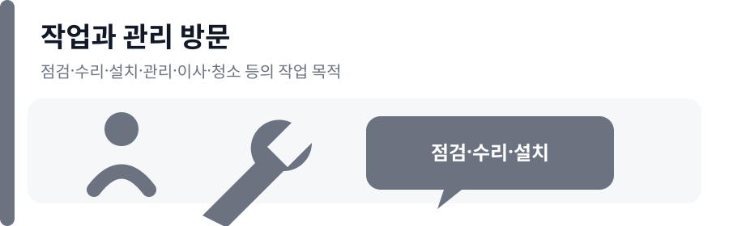

**판정 조건**

- 사람이 감지되고 관리·점검·수리·설치 등 작업 목적을 말한다.

**포함 상황**

- 관리사무소, 경비실, 시설관리 방문
- 가스·전기·수도 검침과 안전점검
- 보일러·수도·전기·도어록·에어컨·인터넷 수리
- 인터넷·가전·가구·정수기 설치
- 방역, 소독, 해충 방제
- 청소, 가사, 세탁 등 생활 서비스
- 이사, 짐 운반, 가구 이동
- 부동산 중개, 집 보기, 감정평가
- 도배, 장판, 페인트, 누수 공사

**예외 조건**

- 예약 여부를 확인할 수 없으면 작업 유형은 유지하고 **사용자 확인 필요**를 추가한다.
- 상품 판매나 가입 권유가 목적이면 **영업과 홍보 방문**으로 분류한다.

---

## 6 공공과 긴급 방문

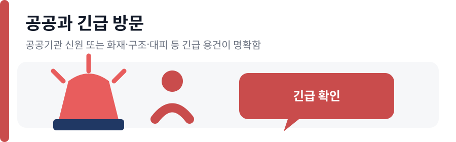

**판정 조건**

- 경찰·소방·구급대·공공기관 직원이 신원과 용건을 명확히 밝힌다.
- 화재·연기·가스 누출·누수·응급환자·구조·대피 상황을 명확히 말한다.

**포함 상황**

- 경찰, 소방, 구급대 방문
- 구청, 주민센터, 법원 등 공공기관 방문
- 화재, 가스 누출, 누수, 응급환자 신고
- 건물 안전 문제와 긴급 대피 안내
- 쓰러진 사람 또는 구체적인 도움 요청

**예외 조건**

- 긴급 단어만 있고 실제 위험 설명이 없으면 긴급으로 확정하지 않는다.
- 긴급으로 분류해도 문을 자동으로 열지 않고 사용자에게 우선 알림만 보낸다.

---

## 7 영업과 홍보 방문

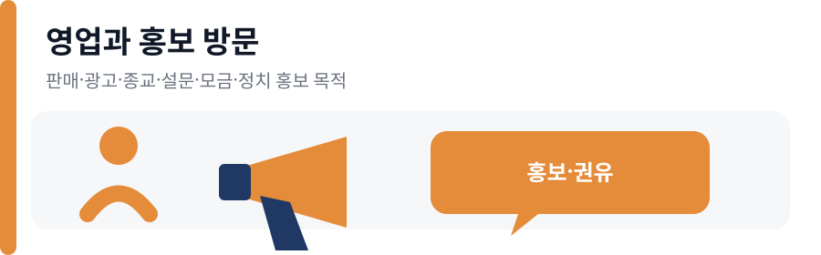

**판정 조건**

- 사람이 감지되고 판매·권유·홍보 목적을 말한다.

**포함 상황**

- 상품 판매, 가입 권유, 통신사 변경, 렌탈 영업
- 전단지, 행사, 매장 홍보
- 종교 권유, 포교, 모임 안내
- 설문조사, 인터뷰, 연구 참여 요청
- 후원, 기부, 모금 요청
- 정치 활동, 선거 운동, 후보자 홍보

**예외 조건**

- 예약·설치·수리 표현이 명확하면 **작업과 관리 방문**을 우선한다.
- 전단지만 남기고 사람이 이탈하면 **물품만 있음**으로 기록할 수 있다.

---

## 8 잘못 방문

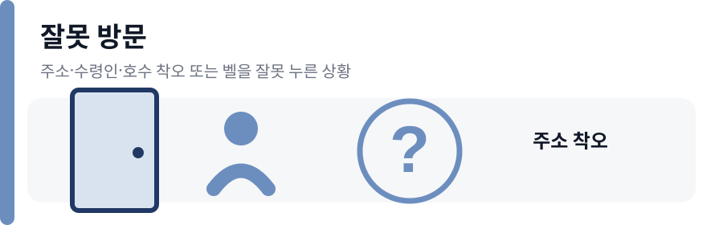

**판정 조건**

- 방문자가 주소·동·호수·수령인 착오를 명확하게 말한다.

**포함 상황**

- 다른 집이나 다른 사람을 찾음
- 이전 거주자를 찾음
- 배송 주소를 잘못 찾음
- 잘못 배송한 물품을 다시 가져가려 함
- 벨을 잘못 눌렀다고 말함
- 아무 말 없이 바로 이탈함

**예외 조건**

- 오배송 물품을 가져가는 목적이 확인되면 세부 유형을 **배송 정정 또는 수거**로 기록한다.
- 아무 말 없이 이탈하면 **목적 불명확 이탈** 상태를 추가한다.

---

## 9 안전 확인 필요

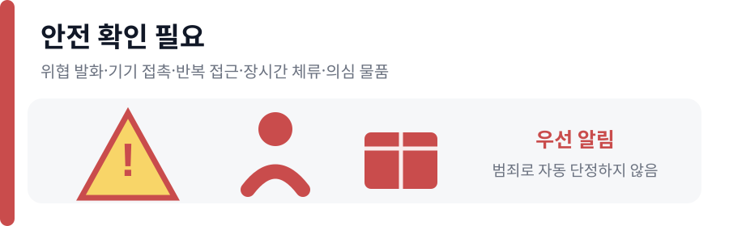

**판정 조건**

- 명확한 위협 발화 또는 반복적·비정상적인 현관 접근이 감지된다.
- 물품이나 사람의 상태 때문에 사용자의 빠른 확인이 필요하다.

**포함 상황**

- 도어록, 문손잡이, 카메라, 초인종을 반복적으로 만짐
- 짧은 시간 안에 반복 접근하거나 벨을 여러 번 누름
- 욕설, 협박, 강제 진입, 파손을 명확히 언급함
- 장시간 머물지만 용건을 말하지 않음
- 카메라를 가리거나 화면이 갑자기 차단됨
- 정체불명 물품을 놓고 빠르게 이탈함
- 쓰러진 사람이나 구체적인 도움 요청이 감지됨

**판정 제한**

- 모델 결과만으로 범죄자·수상한 사람·위험 인물이라고 단정하지 않는다.
- **안전 확인 필요**라는 상태와 우선 알림만 제공한다.

---

## 10 기타와 판단 불가

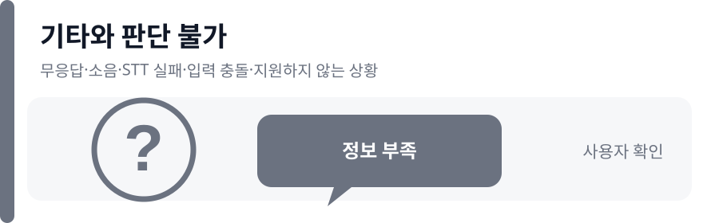

**판정 조건**

- 어느 분류에도 맞지 않거나 분류할 정보가 부족하다.

**포함 상황**

- 방문객이 말하지 않음
- 주변 소음만 녹음됨
- 말은 있지만 알아들을 수 없음
- STT 결과가 비어 있거나 일부만 전사됨
- 지원하지 않는 언어로 말함
- 여러 사람이 동시에 말해 목적을 정할 수 없음
- 한 발화에 여러 목적이 있고 주된 목적이 불명확함
- STT와 요약 내용이 서로 다름
- YOLO, STT 또는 서버 응답이 실패함
- 이미지와 음성 결과가 서로 충돌함

**처리 조건**

- 확인 가능한 명시적 용건이 있으면 해당 유형을 적용한다.
- 정정 발화가 명확하면 마지막으로 확인된 목적을 적용한다.
- 끝까지 확정할 수 없으면 **기타·판단 불가**와 **사용자 확인 필요**를 반환한다.

---

## 공통 분기 조건

- **여러 사람 감지:** 대표 발화로 분류하고 **복수 방문자** 상태를 추가한다.
- **동물만 감지:** 사람 방문으로 응대하지 않는다. 물품이 있으면 **물품만 있음**, 없으면 종료한다.
- **호출벨로 시작:** ToF 결과를 기다리지 않고 사람 분기를 시작하되 이미지에서 사람이 확인되지 않으면 재확인한다.
- **같은 세션에서 벨 재입력:** 새 이벤트를 만들지 않고 같은 eventId에 추가 발화를 병합한다.
- **세션 유예 시간 내 재접근:** 기존 이벤트를 갱신한다.
- **유예 시간 이후 재접근:** 새 이벤트를 만든다.
- **STT 실패:** **기타·판단 불가**로 처리한다.
- **요약 실패:** STT 원문으로 분류하고 요약 실패 상태만 추가한다.
- **네트워크 또는 서버 장애:** 고정 장애 안내 후 세션을 종료하며 상황을 억지로 추정하지 않는다.

## 최종 우선순위

1. 긴급 상황 또는 안전 확인 필요
2. 사람이 없고 물품만 있는 상황
3. 수거 목적이 명확한 상황
4. 배송 상황
5. 공공기관·관리·점검·수리·설치 등 작업 방문
6. 지인·이웃·약속 등 개인 방문
7. 영업·홍보·종교·설문·모금 방문
8. 주소 착오와 잘못 호출
9. 기타·판단 불가

두 조건이 동시에 성립하면 **더 구체적이고 명시적인 용건**을 적용한다. 구체적인 용건을 정할 수 없거나 입력이 충돌하면 **기타·판단 불가**로 처리한다.
